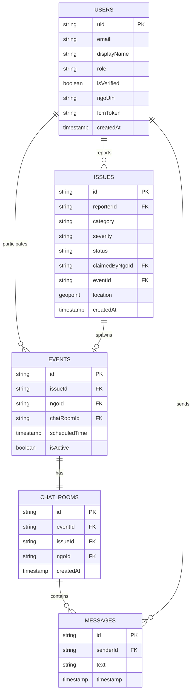
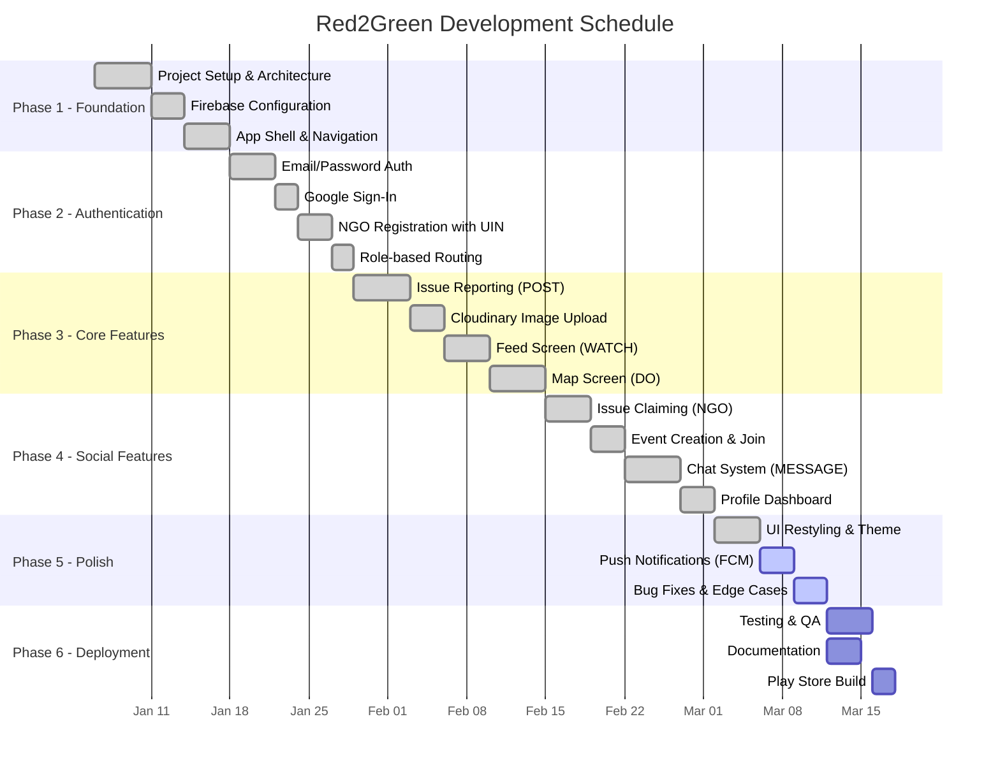

# Red2Green — Appendix

> **Version:** 1.0 &nbsp;|&nbsp; **Date:** February 2026

---

# Appendix A – Source Code Listings

This appendix contains the key source code files that form the backbone of the Red2Green application. The project follows a clean **Model–Service–Provider–Screen** architecture built with Flutter and Dart.

---

## A.1 Project Structure

```
red2green/
├── lib/
│   ├── main.dart                          # App entry point & Provider setup
│   ├── firebase_options.dart              # Firebase config (auto-generated)
│   ├── models/
│   │   ├── user_model.dart                # User data model (3 roles)
│   │   ├── issue_model.dart               # Civic issue model (8 categories)
│   │   ├── event_model.dart               # Cleanup event model
│   │   └── message_model.dart             # Chat message model
│   ├── services/
│   │   ├── auth_service.dart              # Firebase Auth + Google Sign-In
│   │   ├── database_service.dart          # Firestore CRUD operations
│   │   ├── cloudinary_service.dart        # Image compression & CDN upload
│   │   └── location_service.dart          # GPS positioning via geolocator
│   ├── providers/
│   │   ├── auth_provider.dart             # Auth state management (ChangeNotifier)
│   │   ├── issue_provider.dart            # Issue stream & filtering state
│   │   └── chat_provider.dart             # Chat/event state management
│   ├── screens/
│   │   ├── auth/
│   │   │   ├── gateway_screen.dart        # Welcome / landing screen
│   │   │   ├── login_screen.dart          # Email login form
│   │   │   ├── register_screen.dart       # Public/Volunteer registration
│   │   │   └── ngo_register_screen.dart   # NGO registration with UIN
│   │   ├── home/
│   │   │   └── home_screen.dart           # Bottom navigation host
│   │   ├── watch/
│   │   │   └── watch_screen.dart          # Issue feed with filter chips
│   │   ├── do_map/
│   │   │   └── do_screen.dart             # Interactive map with pins
│   │   ├── post/
│   │   │   └── post_screen.dart           # Issue reporting form
│   │   ├── message/
│   │   │   ├── message_screen.dart        # Chat inbox (event list)
│   │   │   └── chat_room_screen.dart      # Real-time chatroom
│   │   ├── profile/
│   │   │   └── profile_screen.dart        # User dashboard & stats
│   │   └── wrapper.dart                   # Auth state router
│   └── widgets/
│       ├── issue_card.dart                # Feed card widget
│       └── event_card_popup.dart          # Map pin popup (Claim/Join)
├── pubspec.yaml                           # Dependencies & config
├── android/                               # Android platform files
└── assets/
    └── images/                            # App assets
```

---

## A.2 Data Models

### A.2.1 User Model (`user_model.dart`)

```dart
import 'package:cloud_firestore/cloud_firestore.dart';

enum UserRole { public, volunteer, ngo }

class UserModel {
  final String uid;
  final String email;
  final String displayName;
  final String? photoUrl;
  final UserRole role;
  final bool isVerified;
  final String? ngoUin;
  final String? ngoName;
  final String? phone;
  final String? fcmToken;
  final DateTime? createdAt;
  final Map<String, dynamic> stats;

  UserModel({
    required this.uid,
    required this.email,
    required this.displayName,
    this.photoUrl,
    this.role = UserRole.public,
    this.isVerified = false,
    this.ngoUin,
    this.ngoName,
    this.phone,
    this.fcmToken,
    this.createdAt,
    this.stats = const {},
  });

  factory UserModel.fromFirestore(DocumentSnapshot doc) {
    Map<String, dynamic> data = doc.data() as Map<String, dynamic>;
    return UserModel(
      uid: doc.id,
      email: data['email'] ?? '',
      displayName: data['displayName'] ?? '',
      photoUrl: data['photoUrl'],
      role: _parseRole(data['role']),
      isVerified: data['isVerified'] ?? false,
      ngoUin: data['ngoUin'],
      ngoName: data['ngoName'],
      phone: data['phone'],
      fcmToken: data['fcmToken'],
      createdAt: (data['createdAt'] as Timestamp?)?.toDate(),
      stats: data['stats'] ?? {},
    );
  }

  Map<String, dynamic> toFirestore() {
    return {
      'email': email,
      'displayName': displayName,
      'photoUrl': photoUrl,
      'role': role.toString().split('.').last,
      'isVerified': isVerified,
      'ngoUin': ngoUin,
      'ngoName': ngoName,
      'phone': phone,
      'fcmToken': fcmToken,
      'createdAt': createdAt != null
          ? Timestamp.fromDate(createdAt!)
          : FieldValue.serverTimestamp(),
      'stats': stats,
    };
  }

  static UserRole _parseRole(String? role) {
    switch (role) {
      case 'volunteer': return UserRole.volunteer;
      case 'ngo':       return UserRole.ngo;
      default:          return UserRole.public;
    }
  }
}
```

---

### A.2.2 Issue Model (`issue_model.dart`)

```dart
import 'package:cloud_firestore/cloud_firestore.dart';

enum IssueStatus { reported, claimed, resolved }

enum IssueCategory {
  garbage, pothole, drainage, brokenProperty,
  illegalPosters, strayAnimals, treeHazard, waterLeakage,
}

class IssueModel {
  final String? id;
  final String reporterId;
  final String reporterName;
  final String? reporterPhotoUrl;
  final GeoPoint location;
  final String photoUrl;
  final IssueCategory category;
  final String severity;
  final String title;
  final String description;
  final IssueStatus status;
  final String? claimedByNgoId;
  final String? claimedByNgoName;
  final String? eventId;
  final DateTime createdAt;
  final DateTime? resolvedAt;
  final bool isAnonymous;
  final List<String> likes;
  final int commentCount;

  IssueModel({
    this.id,
    required this.reporterId,
    required this.reporterName,
    this.reporterPhotoUrl,
    required this.location,
    required this.photoUrl,
    required this.category,
    required this.severity,
    required this.title,
    required this.description,
    this.status = IssueStatus.reported,
    this.claimedByNgoId,
    this.claimedByNgoName,
    this.eventId,
    required this.createdAt,
    this.resolvedAt,
    this.isAnonymous = false,
    this.likes = const [],
    this.commentCount = 0,
  });

  factory IssueModel.fromFirestore(DocumentSnapshot doc) {
    Map<String, dynamic> data = doc.data() as Map<String, dynamic>;
    return IssueModel(
      id: doc.id,
      reporterId: data['reporterId'] ?? '',
      reporterName: data['reporterName'] ?? 'Anonymous',
      reporterPhotoUrl: data['reporterPhotoUrl'],
      location: data['location'] ?? const GeoPoint(0, 0),
      photoUrl: data['photoUrl'] ?? '',
      category: _parseCategory(data['category']),
      severity: data['severity'] ?? 'Medium',
      title: data['title'] ?? '',
      description: data['description'] ?? '',
      status: _parseStatus(data['status']),
      claimedByNgoId: data['claimedByNgoId'],
      claimedByNgoName: data['claimedByNgoName'],
      eventId: data['eventId'],
      createdAt: (data['createdAt'] as Timestamp?)?.toDate() ?? DateTime.now(),
      resolvedAt: (data['resolvedAt'] as Timestamp?)?.toDate(),
      isAnonymous: data['isAnonymous'] ?? false,
      likes: List<String>.from(data['likes'] ?? []),
      commentCount: data['commentCount'] ?? 0,
    );
  }

  Map<String, dynamic> toFirestore() {
    return {
      'reporterId': reporterId,
      'reporterName': reporterName,
      'reporterPhotoUrl': reporterPhotoUrl,
      'location': location,
      'photoUrl': photoUrl,
      'category': category.toString().split('.').last,
      'severity': severity,
      'title': title,
      'description': description,
      'status': status.toString().split('.').last,
      'claimedByNgoId': claimedByNgoId,
      'claimedByNgoName': claimedByNgoName,
      'eventId': eventId,
      'createdAt': Timestamp.fromDate(createdAt),
      'resolvedAt': resolvedAt != null ? Timestamp.fromDate(resolvedAt!) : null,
      'isAnonymous': isAnonymous,
      'likes': likes,
      'commentCount': commentCount,
    };
  }
}
```

---

### A.2.3 Event Model (`event_model.dart`)

```dart
import 'package:cloud_firestore/cloud_firestore.dart';

class EventModel {
  final String? id;
  final String issueId;
  final String ngoId;
  final String ngoName;
  final String? chatRoomId;
  final DateTime? scheduledTime;
  final String? meetingPoint;
  final List<String> participants;
  final bool isActive;
  final DateTime createdAt;

  EventModel({
    this.id,
    required this.issueId,
    required this.ngoId,
    required this.ngoName,
    this.chatRoomId,
    this.scheduledTime,
    this.meetingPoint,
    this.participants = const [],
    this.isActive = true,
    required this.createdAt,
  });

  factory EventModel.fromFirestore(DocumentSnapshot doc) {
    Map<String, dynamic> data = doc.data() as Map<String, dynamic>;
    return EventModel(
      id: doc.id,
      issueId: data['issueId'] ?? '',
      ngoId: data['ngoId'] ?? '',
      ngoName: data['ngoName'] ?? '',
      chatRoomId: data['chatRoomId'],
      scheduledTime: (data['scheduledTime'] as Timestamp?)?.toDate(),
      meetingPoint: data['meetingPoint'],
      participants: List<String>.from(data['participants'] ?? []),
      isActive: data['isActive'] ?? true,
      createdAt: (data['createdAt'] as Timestamp?)?.toDate() ?? DateTime.now(),
    );
  }

  Map<String, dynamic> toFirestore() {
    return {
      'issueId': issueId,
      'ngoId': ngoId,
      'ngoName': ngoName,
      'chatRoomId': chatRoomId,
      'scheduledTime': scheduledTime != null
          ? Timestamp.fromDate(scheduledTime!)
          : null,
      'meetingPoint': meetingPoint,
      'participants': participants,
      'isActive': isActive,
      'createdAt': Timestamp.fromDate(createdAt),
    };
  }
}
```

---

### A.2.4 Message Model (`message_model.dart`)

```dart
import 'package:cloud_firestore/cloud_firestore.dart';

class MessageModel {
  final String? id;
  final String senderId;
  final String senderName;
  final String text;
  final DateTime timestamp;
  final String? photoUrl;

  MessageModel({
    this.id,
    required this.senderId,
    required this.senderName,
    required this.text,
    required this.timestamp,
    this.photoUrl,
  });

  factory MessageModel.fromFirestore(DocumentSnapshot doc) {
    Map<String, dynamic> data = doc.data() as Map<String, dynamic>;
    return MessageModel(
      id: doc.id,
      senderId: data['senderId'] ?? '',
      senderName: data['senderName'] ?? 'Anonymous',
      text: data['text'] ?? '',
      timestamp: (data['timestamp'] as Timestamp?)?.toDate() ?? DateTime.now(),
      photoUrl: data['photoUrl'],
    );
  }

  Map<String, dynamic> toFirestore() {
    return {
      'senderId': senderId,
      'senderName': senderName,
      'text': text,
      'timestamp': Timestamp.fromDate(timestamp),
      'photoUrl': photoUrl,
    };
  }
}
```

---

## A.3 Services

### A.3.1 Authentication Service (`auth_service.dart`)

```dart
import 'package:firebase_auth/firebase_auth.dart';
import 'package:cloud_firestore/cloud_firestore.dart';
import 'package:google_sign_in/google_sign_in.dart';
import '../models/models.dart';

class AuthService {
  final FirebaseAuth _auth = FirebaseAuth.instance;
  final FirebaseFirestore _firestore = FirebaseFirestore.instance;
  final GoogleSignIn _googleSignIn = GoogleSignIn();

  User? get currentUser => _auth.currentUser;
  Stream<User?> get authStateChanges => _auth.authStateChanges();

  // Sign in with email and password
  Future<UserModel?> signInWithEmailAndPassword(String email, String password) async {
    UserCredential result = await _auth.signInWithEmailAndPassword(
      email: email, password: password,
    );
    User? user = result.user;
    if (user != null) return await getUserData(user.uid);
    return null;
  }

  // Sign in with Google
  Future<UserModel?> signInWithGoogle() async {
    final GoogleSignInAccount? googleUser = await _googleSignIn.signIn();
    if (googleUser == null) return null;
    final GoogleSignInAuthentication googleAuth = await googleUser.authentication;
    final AuthCredential credential = GoogleAuthProvider.credential(
      accessToken: googleAuth.accessToken,
      idToken: googleAuth.idToken,
    );
    UserCredential result = await _auth.signInWithCredential(credential);
    User? user = result.user;
    if (user != null) {
      UserModel? existingUser = await getUserData(user.uid);
      if (existingUser != null) return existingUser;
      UserModel newUser = UserModel(
        uid: user.uid,
        email: user.email!,
        displayName: user.displayName ?? 'New User',
        role: UserRole.public,
        createdAt: DateTime.now(),
        stats: {'reports_count': 0, 'events_joined': 0},
      );
      await _firestore.collection('users').doc(user.uid).set(newUser.toFirestore());
      return newUser;
    }
    return null;
  }

  // Register public user or volunteer
  Future<UserModel?> registerPublicUser({
    required String email, required String password,
    required String displayName, required UserRole role, String? phone,
  }) async {
    UserCredential result = await _auth.createUserWithEmailAndPassword(
      email: email, password: password,
    );
    User? user = result.user;
    if (user != null) {
      await user.updateDisplayName(displayName);
      UserModel userModel = UserModel(
        uid: user.uid, email: email, displayName: displayName,
        role: role, phone: phone, createdAt: DateTime.now(),
        stats: {'reports_count': 0, 'events_joined': 0},
      );
      await _firestore.collection('users').doc(user.uid).set(userModel.toFirestore());
      return userModel;
    }
    return null;
  }

  // Register NGO
  Future<UserModel?> registerNGO({
    required String email, required String password,
    required String organizationName, required String contactPerson,
    required String ngoUin, String? phone,
  }) async {
    UserCredential result = await _auth.createUserWithEmailAndPassword(
      email: email, password: password,
    );
    User? user = result.user;
    if (user != null) {
      await user.updateDisplayName(organizationName);
      UserModel userModel = UserModel(
        uid: user.uid, email: email, displayName: organizationName,
        role: UserRole.ngo, isVerified: false, ngoUin: ngoUin,
        phone: phone, createdAt: DateTime.now(),
        stats: {'issues_claimed': 0, 'issues_resolved': 0, 'volunteer_count': 0},
      );
      await _firestore.collection('users').doc(user.uid).set(userModel.toFirestore());
      return userModel;
    }
    return null;
  }

  Future<UserModel?> getUserData(String uid) async {
    DocumentSnapshot doc = await _firestore.collection('users').doc(uid).get();
    if (doc.exists) return UserModel.fromFirestore(doc);
    return null;
  }

  Future<void> signOut() async => await _auth.signOut();

  Future<void> sendPasswordResetEmail(String email) async {
    await _auth.sendPasswordResetEmail(email: email);
  }
}
```

---

### A.3.2 Database Service (`database_service.dart`)

```dart
import 'package:cloud_firestore/cloud_firestore.dart';
import '../models/models.dart';

class DatabaseService {
  final FirebaseFirestore _firestore = FirebaseFirestore.instance;

  CollectionReference get issuesCollection => _firestore.collection('issues');
  CollectionReference get eventsCollection => _firestore.collection('events');
  CollectionReference get chatRoomsCollection => _firestore.collection('chat_rooms');

  // Create new issue
  Future<String> createIssue(IssueModel issue) async {
    DocumentReference docRef = await issuesCollection.add(issue.toFirestore());
    return docRef.id;
  }

  // Get issues stream (for WATCH feed)
  Stream<List<IssueModel>> getIssuesStream({IssueStatus? statusFilter}) {
    Query query = issuesCollection.orderBy('createdAt', descending: true);
    if (statusFilter != null) {
      query = query.where('status', isEqualTo: statusFilter.toString().split('.').last);
    }
    return query.snapshots().map((snapshot) {
      return snapshot.docs.map((doc) => IssueModel.fromFirestore(doc)).toList();
    });
  }

  // Claim issue (NGO only) - Creates event and chat room
  Future<Map<String, dynamic>?> claimIssue(String issueId, String ngoId, String ngoName) async {
    final issueDoc = await issuesCollection.doc(issueId).get();
    if (!issueDoc.exists) return {'success': false, 'message': 'Issue not found'};

    final issueData = issueDoc.data() as Map<String, dynamic>;
    final currentStatus = issueData['status'];
    if (currentStatus == 'claimed') return {'success': false, 'message': 'Already claimed'};
    if (currentStatus == 'resolved') return {'success': false, 'message': 'Already resolved'};

    // Create event
    final eventData = {
      'issueId': issueId, 'ngoId': ngoId, 'ngoName': ngoName,
      'createdAt': Timestamp.fromDate(DateTime.now()),
      'participants': [ngoId], 'isActive': true,
    };
    final eventRef = await eventsCollection.add(eventData);

    // Create chat room
    final chatRoomData = {
      'eventId': eventRef.id, 'issueId': issueId,
      'ngoId': ngoId, 'ngoName': ngoName,
      'createdAt': Timestamp.fromDate(DateTime.now()),
      'participants': [ngoId],
    };
    final chatRoomRef = await chatRoomsCollection.add(chatRoomData);

    // Update event with chat room ID
    await eventRef.update({'chatRoomId': chatRoomRef.id});

    // Update issue status to claimed
    await issuesCollection.doc(issueId).update({
      'status': 'claimed', 'claimedByNgoId': ngoId,
      'claimedByNgoName': ngoName, 'eventId': eventRef.id,
    });

    return {'success': true, 'eventId': eventRef.id, 'chatRoomId': chatRoomRef.id};
  }

  // Join event
  Future<void> joinEvent(String eventId, String userId) async {
    await eventsCollection.doc(eventId).update({
      'participants': FieldValue.arrayUnion([userId]),
    });
  }

  // Join chat room
  Future<void> joinChatRoom(String eventId, String userId) async {
    final eventDoc = await eventsCollection.doc(eventId).get();
    final eventData = eventDoc.data() as Map<String, dynamic>;
    final chatRoomId = eventData['chatRoomId'];
    await chatRoomsCollection.doc(chatRoomId).update({
      'participants': FieldValue.arrayUnion([userId]),
    });
    // Post system message
    final joinMessage = MessageModel(
      senderId: 'system', senderName: 'System',
      text: 'A new volunteer has joined the cleanup event!',
      timestamp: DateTime.now(),
    );
    await chatRoomsCollection.doc(chatRoomId)
        .collection('messages').add(joinMessage.toFirestore());
  }

  // Send message
  Future<void> sendMessage(String chatRoomId, MessageModel message) async {
    await chatRoomsCollection.doc(chatRoomId)
        .collection('messages').add(message.toFirestore());
  }

  // Get chat messages stream
  Stream<List<MessageModel>> getChatMessagesStream(String chatRoomId) {
    return chatRoomsCollection.doc(chatRoomId)
        .collection('messages').orderBy('timestamp', descending: false)
        .snapshots().map((snapshot) {
      return snapshot.docs.map((doc) => MessageModel.fromFirestore(doc)).toList();
    });
  }
}
```

---

### A.3.3 Cloudinary Service (`cloudinary_service.dart`)

```dart
import 'dart:io';
import 'dart:convert';
import 'package:http/http.dart' as http;
import 'package:image/image.dart' as img;
import 'package:path_provider/path_provider.dart';
import 'package:crypto/crypto.dart';

class CloudinaryService {
  static const String cloudName = 'delpnz3ar';
  static const String apiKey = '394547485135397';
  static const String apiSecret = '****'; // redacted for security

  Future<String?> uploadImage(File imageFile) async {
    final compressedFile = await _compressImage(imageFile);
    final imageUrl = await _uploadToCloudinary(compressedFile);
    if (compressedFile.path != imageFile.path) await compressedFile.delete();
    return imageUrl;
  }

  Future<File> _compressImage(File file) async {
    final bytes = await file.readAsBytes();
    img.Image? image = img.decodeImage(bytes);
    if (image == null) return file;

    const maxDimension = 1080;
    if (image.width > maxDimension || image.height > maxDimension) {
      image = image.width > image.height
          ? img.copyResize(image, width: maxDimension)
          : img.copyResize(image, height: maxDimension);
    }

    final compressedBytes = img.encodeJpg(image, quality: 80);
    final tempDir = await getTemporaryDirectory();
    final tempFile = File(
      '${tempDir.path}/compressed_${DateTime.now().millisecondsSinceEpoch}.jpg'
    );
    await tempFile.writeAsBytes(compressedBytes);
    return tempFile;
  }

  Future<String?> _uploadToCloudinary(File file) async {
    final timestamp = DateTime.now().millisecondsSinceEpoch ~/ 1000;
    final signatureString = 'timestamp=$timestamp$apiSecret';
    final signature = sha1.convert(utf8.encode(signatureString)).toString();

    final uri = Uri.parse(
      'https://api.cloudinary.com/v1_1/$cloudName/image/upload'
    );
    final request = http.MultipartRequest('POST', uri);
    request.fields['api_key'] = apiKey;
    request.fields['timestamp'] = timestamp.toString();
    request.fields['signature'] = signature;

    final multipartFile = http.MultipartFile(
      'file', http.ByteStream(file.openRead()), await file.length(),
      filename: 'issue_${DateTime.now().millisecondsSinceEpoch}.jpg',
    );
    request.files.add(multipartFile);

    final response = await request.send();
    final responseData = await response.stream.bytesToString();
    if (response.statusCode == 200) {
      return json.decode(responseData)['secure_url'] as String?;
    }
    return null;
  }
}
```

---

### A.3.4 Location Service (`location_service.dart`)

```dart
import 'package:geolocator/geolocator.dart';

class LocationService {
  Future<bool> isLocationServiceEnabled() async {
    return await Geolocator.isLocationServiceEnabled();
  }

  Future<LocationPermission> checkPermission() async {
    return await Geolocator.checkPermission();
  }

  Future<LocationPermission> requestPermission() async {
    return await Geolocator.requestPermission();
  }

  Future<Position?> getCurrentPosition() async {
    bool serviceEnabled = await isLocationServiceEnabled();
    if (!serviceEnabled) return null;

    LocationPermission permission = await checkPermission();
    if (permission == LocationPermission.denied) {
      permission = await requestPermission();
      if (permission == LocationPermission.denied) return null;
    }
    if (permission == LocationPermission.deniedForever) return null;

    return await Geolocator.getCurrentPosition(
      desiredAccuracy: LocationAccuracy.high,
    );
  }

  Stream<Position> getPositionStream() {
    return Geolocator.getPositionStream(
      locationSettings: const LocationSettings(
        accuracy: LocationAccuracy.high,
        distanceFilter: 10,
      ),
    );
  }
}
```

---

## A.4 Dependencies (`pubspec.yaml`)

```yaml
name: red2green
description: Community-driven mobile platform for urban cleanliness
version: 1.0.0+1

environment:
  sdk: '>=3.0.0 <4.0.0'

dependencies:
  flutter:
    sdk: flutter

  # Firebase
  firebase_core: ^3.8.0
  cloud_firestore: ^5.5.0
  firebase_auth: ^5.3.3
  firebase_messaging: ^15.1.5
  cloud_functions: ^5.3.3
  google_sign_in: ^6.2.1

  # Maps & Location
  flutter_map: ^7.0.2
  latlong2: ^0.9.1
  geolocator: ^10.1.0

  # State Management
  provider: ^6.1.1

  # UI & Media
  image_picker: ^1.0.7
  cached_network_image: ^3.3.1
  flutter_local_notifications: ^18.0.0
  intl: ^0.19.0

  # Image Upload & Compression
  cloudinary_flutter: ^1.3.0
  cloudinary_url_gen: ^1.6.0
  image: ^4.1.3
  path_provider: ^2.1.1

  # Utilities
  url_launcher: ^6.2.2
  share_plus: ^7.2.1
  http: ^1.1.0
```

---

---

# Appendix B – Database Design

## B.1 Database Technology

Red2Green uses **Cloud Firestore**, a NoSQL document database by Google Firebase. Firestore stores data in **collections** of **documents**, each document being a JSON-like map of key-value fields.

**Why Firestore was chosen:**
- Real-time listeners — push-based data sync to all clients instantly
- Offline persistence — cached reads when device is offline
- Horizontal auto-scaling — no capacity planning required
- Serverless — no database server to manage

---

## B.2 Collection Schemas

### `users` Collection

| Field | Type | Constraint | Description |
|:---|:---|:---|:---|
| `uid` | String | **PK** (Document ID) | Firebase Auth UID |
| `email` | String | Required, Unique | Login email |
| `displayName` | String | Required | Full name or org name |
| `photoUrl` | String | Optional | Profile picture (Cloudinary URL) |
| `role` | String | Required | `public` / `volunteer` / `ngo` |
| `isVerified` | Boolean | Default: `false` | NGO UIN verification status |
| `ngoUin` | String | Optional | NGO Unique Identification Number |
| `ngoName` | String | Optional | Organisation name |
| `phone` | String | Optional | Contact number |
| `fcmToken` | String | Optional | Push notification device token |
| `createdAt` | Timestamp | Auto-set | Account creation timestamp |
| `stats` | Map | Default: `{}` | `{reports_count, events_joined}` or `{issues_claimed, issues_resolved, volunteer_count}` |

---

### `issues` Collection

| Field | Type | Constraint | Description |
|:---|:---|:---|:---|
| `id` | String | **PK** (Auto ID) | Firestore auto-generated |
| `reporterId` | String | **FK** → `users.uid` | Reporter's UID |
| `reporterName` | String | Required | Display name (or "Anonymous") |
| `reporterPhotoUrl` | String | Optional | Reporter's avatar URL |
| `location` | GeoPoint | Required | `{latitude, longitude}` |
| `photoUrl` | String | Required | Issue photo (Cloudinary CDN URL) |
| `category` | String | Required | One of 8 categories |
| `severity` | String | Required | `Low` / `Medium` / `High` |
| `title` | String | Required | Short issue title |
| `description` | String | Required | Detailed description |
| `status` | String | Default: `reported` | `reported` / `claimed` / `resolved` |
| `claimedByNgoId` | String | **FK** → `users.uid` | NGO that claimed it |
| `claimedByNgoName` | String | Optional | NGO display name |
| `eventId` | String | **FK** → `events.id` | Linked cleanup event |
| `createdAt` | Timestamp | Auto-set | Report submission time |
| `resolvedAt` | Timestamp | Optional | Resolution time |
| `isAnonymous` | Boolean | Default: `false` | Identity hidden flag |
| `likes` | Array<String> | Default: `[]` | UIDs of users who liked |
| `commentCount` | Integer | Default: `0` | Total comments |

---

### `events` Collection

| Field | Type | Constraint | Description |
|:---|:---|:---|:---|
| `id` | String | **PK** (Auto ID) | Firestore auto-generated |
| `issueId` | String | **FK** → `issues.id` | Parent issue |
| `ngoId` | String | **FK** → `users.uid` | Organising NGO |
| `ngoName` | String | Required | NGO display name |
| `chatRoomId` | String | **FK** → `chat_rooms.id` | Linked chatroom |
| `scheduledTime` | Timestamp | Optional | Event date/time |
| `meetingPoint` | String | Optional | Meeting location text |
| `participants` | Array<String> | Default: `[ngoId]` | UIDs of all participants |
| `isActive` | Boolean | Default: `true` | `false` when resolved |
| `createdAt` | Timestamp | Auto-set | Event creation time |

---

### `chat_rooms` Collection

| Field | Type | Constraint | Description |
|:---|:---|:---|:---|
| `id` | String | **PK** (Auto ID) | Firestore auto-generated |
| `eventId` | String | **FK** → `events.id` | Parent event |
| `issueId` | String | **FK** → `issues.id` | Associated issue |
| `ngoId` | String | **FK** → `users.uid` | Organising NGO |
| `ngoName` | String | Required | NGO display name |
| `createdAt` | Timestamp | Auto-set | Chatroom creation time |
| `participants` | Array<String> | Default: `[ngoId]` | UIDs of participants |
| `lastMessage` | String | Optional | Preview of latest message |
| `lastMessageTime` | Timestamp | Optional | Latest message time |

---

### `chat_rooms/{id}/messages` Subcollection

| Field | Type | Constraint | Description |
|:---|:---|:---|:---|
| `id` | String | **PK** (Auto ID) | Firestore auto-generated |
| `senderId` | String | **FK** → `users.uid` | Sender UID (or `system`) |
| `senderName` | String | Required | Display name |
| `text` | String | Required | Message body |
| `timestamp` | Timestamp | Auto-set | Sent time |
| `photoUrl` | String | Optional | Image attachment URL |

---

## B.3 Index Design

Firestore requires **composite indexes** for queries combining `where()` and `orderBy()` on different fields:

| Collection | Fields Indexed | Query Purpose |
|:---|:---|:---|
| `issues` | `status` + `createdAt` (desc) | Filtered feed (e.g., "all reported issues, newest first") |
| `issues` | `reporterId` + `createdAt` (desc) | User's own reports on Profile screen |
| `events` | `participants` (array-contains) + `createdAt` (desc) | User's events on Message screen |
| `chat_rooms/{id}/messages` | `timestamp` (asc) | Chronological chat history |

---

## B.4 Entity Relationship Diagram



---

---

# Appendix C – Security Implementation

## C.1 Authentication Security

| Layer | Implementation | Detail |
|:---|:---|:---|
| **Identity Provider** | Firebase Authentication | Email/password + Google OAuth 2.0 sign-in |
| **Token Type** | JSON Web Token (JWT) | Issued by Firebase Auth on login; expires in 1 hour, auto-refreshed by SDK |
| **Password Storage** | Firebase-managed | Passwords are hashed with bcrypt by Firebase; never stored in plaintext |
| **Session Management** | Firebase Auth SDK | Persistent login across app restarts; `authStateChanges()` stream monitors state |

---

## C.2 Authorization & Access Control

Red2Green implements **Role-Based Access Control (RBAC)** with three roles:

| Role | Permissions |
|:---|:---|
| `public` | Register, report issues, view feed, like issues, view map, edit own profile |
| `volunteer` | All `public` permissions + join events, access chatrooms, coordinate cleanup |
| `ngo` | All `volunteer` permissions + claim issues, create events, schedule cleanup, mark resolved |

### Firestore Security Rules (Conceptual)

```
rules_version = '2';
service cloud.firestore {
  match /databases/{database}/documents {

    // Users: read own data; write only own document
    match /users/{userId} {
      allow read: if request.auth != null;
      allow write: if request.auth.uid == userId;
    }

    // Issues: any authenticated user can read; only reporter can create
    match /issues/{issueId} {
      allow read: if request.auth != null;
      allow create: if request.auth != null;
      allow update: if request.auth != null
                    && (request.auth.uid == resource.data.reporterId
                        || resource.data.claimedByNgoId == request.auth.uid);
    }

    // Events: participants can read; NGO can create
    match /events/{eventId} {
      allow read: if request.auth != null;
      allow create: if request.auth != null;
      allow update: if request.auth.uid in resource.data.participants;
    }

    // Chat rooms: only participants can read/write
    match /chat_rooms/{chatRoomId} {
      allow read, write: if request.auth.uid in resource.data.participants;

      match /messages/{messageId} {
        allow read, write: if request.auth != null;
      }
    }
  }
}
```

---

## C.3 Data Security

| Concern | Measure |
|:---|:---|
| **Data in Transit** | All Firebase SDK calls use TLS 1.2+ (HTTPS). Cloudinary uploads use `secure_url` (HTTPS CDN). |
| **Data at Rest** | Firestore encrypts all data at rest using Google-managed AES-256 encryption keys. |
| **Image Upload Auth** | Cloudinary signed uploads use SHA-1 HMAC signature generated from `apiSecret + timestamp`. Only the server-side secret can produce valid signatures. |
| **API Key Protection** | Firebase API keys are restricted to the Android app via SHA-1 certificate fingerprint matching in the Firebase Console. |
| **Anonymous Reporting** | When `isAnonymous = true`, the reporter's name is replaced with "Anonymous" and `reporterPhotoUrl` is set to `null` before Firestore write. The `reporterId` FK is retained for internal tracking only. |

---

## C.4 Input Validation

| Input | Validation | Location |
|:---|:---|:---|
| Email | RFC 5322 format check | `TextFormField` validator + Firebase Auth |
| Password | Minimum 6 characters (Firebase default) | Firebase Auth enforcement |
| Issue Title | Non-empty, max 100 chars | `TextFormField` validator |
| Issue Description | Non-empty | `TextFormField` validator |
| Photo | Required before submit; compressed to max 1080px, 80% JPEG | `ImagePicker` + `CloudinaryService._compressImage()` |
| GPS Location | Must be non-null; checked via `LocationService.getCurrentPosition()` | Submit blocked if `null` |
| Issue Category | Must be one of 8 `IssueCategory` enum values | Dart enum type safety |
| Severity | Must be `Low`, `Medium`, or `High` | Controlled UI selector |

---

## C.5 Privacy Measures

| Feature | Description |
|:---|:---|
| **Anonymous Reporting** | Users can toggle anonymous mode; name and photo are scrubbed from the public-facing issue record. |
| **FCM Token Scoping** | Push notification tokens are stored per-user and never shared with other users or third-parties. |
| **Minimal Data Collection** | Only essential data is collected (no browsing history, no device fingerprinting). |
| **Data Deletion** | User can sign out and request account deletion through Firebase Auth, which cascades to Firestore documents. |

---

---

# Appendix D – Development Schedule

## D.1 Project Timeline

The Red2Green project follows an **Agile incremental** development approach divided into 6 phases over approximately 10 weeks.



---

## D.2 Phase Breakdown

### Phase 1 — Foundation (Week 1–2)

| Task | Duration | Deliverable |
|:---|:---|:---|
| Flutter project creation | 1 day | Clean project skeleton with asset structure |
| Firebase project setup | 2 days | `google-services.json`, `firebase_options.dart` |
| Dependency installation | 1 day | All 20+ packages in `pubspec.yaml` |
| App shell & bottom navigation | 4 days | 5-tab navigation: Watch, Do, Post, Messages, Profile |
| App icon & splash screen | 1 day | Branded launcher icon and native splash |

---

### Phase 2 — Authentication (Week 2–3)

| Task | Duration | Deliverable |
|:---|:---|:---|
| Gateway screen | 1 day | Welcome/landing page with role selection |
| Email/password sign-up & login | 3 days | `AuthService`, `AuthProvider`, login/register screens |
| Google Sign-In | 2 days | OAuth flow with auto user creation |
| NGO registration | 3 days | UIN input field, verification flag, separate form |
| Role-based wrapper | 2 days | `wrapper.dart` routing by `UserRole` enum |

---

### Phase 3 — Core Features (Week 3–5)

| Task | Duration | Deliverable |
|:---|:---|:---|
| Issue reporting form | 5 days | `PostScreen` with camera, category, severity, description |
| Cloudinary integration | 3 days | `CloudinaryService` — compress + signed upload |
| WATCH feed screen | 4 days | `WatchScreen` with real-time stream and filter chips |
| DO map screen | 5 days | `DoScreen` with `flutter_map`, colour-coded pins, popup |

---

### Phase 4 — Social Features (Week 5–7)

| Task | Duration | Deliverable |
|:---|:---|:---|
| Issue claiming flow | 4 days | `claimIssue()` — event + chatroom creation |
| Volunteer join flow | 3 days | `joinEvent()` + `joinChatRoom()` with system messages |
| Real-time chat system | 5 days | `MessageScreen` inbox + `ChatRoomScreen` |
| Profile dashboard | 3 days | Stats card, menu items, sign-out flow |

---

### Phase 5 — Polish (Week 7–8)

| Task | Duration | Deliverable |
|:---|:---|:---|
| UI restyling | 4 days | Teal/emerald theme, glassmorphism, new card designs |
| FCM push notifications | 3 days | Token management + trigger-based notifications |
| Bug fixes & edge cases | 3 days | Error handling, loading states, offline resilience |

---

### Phase 6 — Deployment (Week 9–10)

| Task | Duration | Deliverable |
|:---|:---|:---|
| End-to-end testing | 4 days | All user flows tested on physical device |
| Documentation | 3 days | System Design report, README, Appendix |
| Release build | 2 days | Signed APK / AAB for Play Store submission |

---

## D.3 Technology Stack Summary

| Layer | Technology | Version |
|:---|:---|:---|
| **Language** | Dart | 3.0.0+ |
| **Framework** | Flutter | 3.2.3 |
| **Backend** | Firebase (Auth, Firestore, FCM, Cloud Functions) | latest |
| **Database** | Cloud Firestore (NoSQL) | latest |
| **Media CDN** | Cloudinary | API v1.1 |
| **Maps** | flutter_map + TomTom tiles | 7.0.2 |
| **GPS** | geolocator | 10.1.0 |
| **State Mgmt** | Provider (ChangeNotifier) | 6.1.1 |
| **IDE** | VS Code / Android Studio | latest |
| **Target OS** | Android 8.0+ (API 26+) | — |

---

*End of Red2Green Appendix — v1.0*
