# Red2Green — System Design Report

> **Version:** 1.0 &nbsp;|&nbsp; **Date:** February 2026  
> **Stack:** Flutter · Firebase · Cloudinary · Cloud Firestore · FCM

---

## Table of Contents

1. [4.1 High Level Design (HLD)](#41-high-level-design-hld)
   - [4.1.1 Overall Architecture Design](#411-overall-architecture-design)
   - [4.1.2 Module Design](#412-module-design)
   - [4.1.3 Database Design (ER Diagram)](#413-database-design-er-diagram)
   - [4.1.4 Data Flow Diagrams (DFD)](#414-data-flow-diagrams-dfd)
2. [4.2 Low Level Design (LLD)](#42-low-level-design-lld)
   - [4.2.1 Module Design (Detailed)](#421-module-design-detailed)
   - [4.2.2 Database Design (Schema)](#422-database-design-schema)
   - [4.2.3 API Design](#423-api-design)

---

# 4.1 High Level Design (HLD)

High Level Design (HLD) describes the **overall architecture** of the Red2Green system. It answers: *How are the main components connected?*

---

## 4.1.1 Overall Architecture Design

Red2Green follows a **3-Tier Cloud-Based Client–Server Architecture**:

| Tier | Layer | Technology |
|:---|:---|:---|
| **Presentation (Tier 1)** | Flutter Mobile App (UI) | Flutter 3.2.3 + Dart |
| **Logic (Tier 2)** | Firebase Cloud Functions + Services | Firebase Firestore, FCM, Auth |
| **Data (Tier 3)** | Cloud Databases + Media CDN | Firestore (NoSQL), Cloudinary CDN |

### Architecture Description

- **Client–Server Architecture:** The Flutter mobile app (client) communicates with Firebase backend (server) over HTTPS/WebSocket.
- **3-Tier Architecture:** Strict separation of UI, business logic, and data layers ensures maintainability and scalability.
- **Cloud-Based Architecture:** All data is hosted on Google Firebase infrastructure with zero on-premise servers. Cloudinary handles media delivery globally via CDN.

### Overall Architecture Diagram

---

## 4.1.2 Module Design

The Red2Green system is divided into **6 core modules**, each responsible for a distinct set of features.

### Module Overview

```mermaid
graph LR
    A[🧑 User Module] --> B[📋 Issue Reporting Module]
    B --> C[🏢 NGO Module]
    C --> D[📍 Geo-Tracking Module]
    D --> E[🔔 Notification Module]
    C --> F[💬 Chat / Coordination Module]
    G[🛡️ Admin Module] --> A
    G --> C
    G --> B
```

### Module Descriptions

---

#### 🧑 User Module
**Functionality:** Manages all user types — Public Citizens, Volunteers, and NGOs.
- Registration and login (email/password via Firebase Auth)
- NGO registration with UIN (Unique Identification Number) verification
- Role assignment: `public`, `volunteer`, `ngo`
- Profile management (display name, photo, phone)
- User statistics tracking (reports submitted, events joined)

---

#### 📋 Issue Reporting Module
**Functionality:** Allows public users to document and submit urban civic issues.
- Photo capture and upload (Cloudinary CDN)
- Issue categorisation: Garbage, Pothole, Drainage, Broken Property, Illegal Posters, Stray Animals, Tree Hazard, Water Leakage
- Severity tagging: Low / Medium / High
- Anonymous reporting toggle
- Real-time feed display with like and comment count
- Issue lifecycle: **Reported → Claimed → Resolved** (Red Pin → Yellow Pin → Green Pin)

---

#### 🏢 NGO Module
**Functionality:** Enables verified NGOs to take ownership of reported issues and organise cleanup events.
- Claim an issue (converts to Volunteer Event)
- Schedule event date/time and meeting point
- Manage volunteers in event rosters
- Mark issues as resolved (pin turns Green)

---

#### 📍 Geo-Tracking Module
**Functionality:** Geospatial visualisation and tracking of all civic issues on a live map.
- Real-time map with `flutter_map` and OpenStreetMap tiles
- Colour-coded map pins:
  - 🔴 Red = Reported (unresolved)
  - 🟡 Yellow = Claimed (in progress)
  - 🟢 Green = Resolved
- GPS-based location tagging of every reported issue
- Distance-based issue filtering

---

#### 🔔 Notification Module
**Functionality:** Keeps all stakeholders informed of system events in real time.
- Firebase Cloud Messaging (FCM) push notifications
- Triggers: Issue claimed, volunteer joined, event scheduled, issue resolved
- In-app notification badges
- FCM token management per user device

---

#### 💬 Chat / Coordination Module
**Functionality:** Provides a structured chatroom for coordination between NGOs and volunteers.
- Chatroom automatically created when an NGO claims an issue
- All volunteers who join the event are added to the chatroom
- Real-time messaging via Firestore subcollections
- System messages on join/leave events

---

#### 🛡️ Admin Module
**Functionality:** Platform oversight and management capabilities.
- User role management (promote/demote)
- NGO verification status control
- Issue moderation (delete abusive reports)
- Platform analytics (total issues, resolved count, active NGOs)

---

### Module Interaction Diagram

```mermaid
flowchart TD
    U([👤 Public User]) -->|Submit Issue| IR[Issue Reporting Module]
    U -->|Sign Up / Login| UM[User Module]
    NGO([🏢 NGO User]) -->|Claim Issue| NM[NGO Module]
    NGO -->|Send Message| CM[Chat Module]
    V([🙋 Volunteer]) -->|Join Event| NM
    V -->|Send Message| CM

    IR -->|Store Issue\nGeoPoint| GT[Geo-Tracking Module]
    IR -->|Trigger FCM| NF[Notification Module]
    NM -->|Update Status| GT
    NM -->|Create Chatroom| CM
    NM -->|Trigger FCM| NF
    CM -->|Real-time Stream| NF
    UM -->|Auth Token| IR
    UM -->|Auth Token| NM

    style IR fill:#ef4444,color:#fff
    style NM fill:#eab308,color:#000
    style GT fill:#22c55e,color:#fff
    style NF fill:#3b82f6,color:#fff
    style CM fill:#8b5cf6,color:#fff
    style UM fill:#f97316,color:#fff
```

---

## 4.1.3 Database Design (ER Diagram)

Red2Green uses **Cloud Firestore (NoSQL)** as its database. The core collections and their relationships are shown below.

### Entity Relationship Diagram

---

## 4.1.4 Data Flow Diagrams (DFD)

### Level 0 DFD — Context Diagram

The context diagram shows the Red2Green system as a single process interacting with three external actors.

```mermaid
flowchart LR
    PU([👤 Public User])
    NG([🏢 NGO])
    VL([🙋 Volunteer])

    SYS["🌐 Red2Green\nSystem"]

    PU -->|Sign Up, Post Issue, Like, Comment| SYS
    NG -->|Sign Up with UIN, Claim Issue,\nSchedule Event, Resolve Issue| SYS
    VL -->|Join Event, Send Message| SYS

    SYS -->|Feed, Map View, Notifications| PU
    SYS -->|Issue List, Event Dashboard,\nChatroom, Notifications| NG
    SYS -->|Event Details, Chatroom,\nNotifications| VL
```

---

### Level 1 DFD

Breaks the system into its core processes and shows how data moves between them.

```mermaid
flowchart TD
    P1["1.0\nOnboarding\n& Auth"]
    P2["2.0\nIssue\nReporting"]
    P3["3.0\nIssue\nClaiming"]
    P4["4.0\nEvent\nCoordination"]
    P5["5.0\nNotification\nDispatch"]
    P6["6.0\nResolution\n& Archive"]

    DS1[(Users\nFirestore)]
    DS2[(Issues\nFirestore)]
    DS3[(Events\nFirestore)]
    DS4[(ChatRooms\nFirestore)]
    DS5[(Cloudinary\nCDN)]

    PU([👤 Public])
    NG([🏢 NGO])
    VL([🙋 Volunteer])

    PU -->|Email, Password, Role| P1
    NG -->|Email, UIN, NGO Name| P1
    VL -->|Email, Password| P1
    P1 -->|User Record| DS1

    PU -->|Photo, Location, Category, Title| P2
    P2 -->|Image Upload| DS5
    DS5 -->|Image URL| P2
    P2 -->|Issue Record\nStatus=Reported| DS2

    NG -->|Claim Action| P3
    DS2 -->|Issue Data| P3
    P3 -->|Update Status=Claimed| DS2
    P3 -->|Create Event| DS3
    P3 -->|Create ChatRoom| DS4
    P3 -->|Trigger FCM| P5

    VL -->|Join Event| P4
    P4 -->|Add to Participants| DS3
    P4 -->|Add to ChatRoom| DS4
    P4 -->|Trigger FCM| P5

    NG -->|Send Message| P4
    VL -->|Send Message| P4
    P4 -->|Store Message| DS4

    P5 -->|Push Notification| PU
    P5 -->|Push Notification| VL

    NG -->|Mark Resolved| P6
    P6 -->|Update Status=Resolved| DS2
    P6 -->|isActive=false| DS3
    P6 -->|Trigger FCM| P5
```

---

### Level 2 DFD — Issue Lifecycle (Based on Flow Image)

This diagram follows the exact phase-step flow: Onboarding → Reporting → Claiming → Scheduling → Joining → Coordination → Resolution.

```mermaid
sequenceDiagram
    autonumber
    participant PU as 👤 Public User
    participant SYS as 🌐 Red2Green System
    participant NG as 🏢 NGO
    participant VL as 🙋 Volunteer
    participant DB as 🗄️ Firestore

    rect rgb(230, 244, 255)
        Note over PU,DB: Phase 1 — Onboarding
        PU->>SYS: 1.1 Sign Up (Role = Public)
        SYS->>DB: Create User Record (role=public)
        NG->>SYS: 1.2 Sign Up with UIN
        SYS->>SYS: Verify UIN via API
        SYS->>DB: Create User Record (role=ngo, isVerified=true)
    end

    rect rgb(255, 235, 235)
        Note over PU,DB: Phase 2 — Reporting
        PU->>SYS: 2.1 Submit Report (POST)
        SYS->>DB: Create Issue (status=reported)
        SYS-->>PU: 🔴 Red Pin on Map, Feed Updated
    end

    rect rgb(255, 249, 220)
        Note over NG,DB: Phase 3 — Claiming & Scheduling
        NG->>SYS: 3.1 Tap Red Pin → "Claim"
        SYS->>DB: Update Issue (status=claimed)
        SYS->>DB: Create Event + ChatRoom
        SYS-->>NG: 🟡 Pin turns Yellow, Chatroom Created
        NG->>SYS: 3.2 Set Date/Time & Meeting Point
        SYS->>DB: Update Event (scheduledTime, meetingPoint)
        SYS-->>VL: Event details visible on Map
    end

    rect rgb(220, 255, 230)
        Note over VL,DB: Phase 4 — Joining
        VL->>SYS: 4.1 Tap Yellow Pin → "Join"
        SYS->>DB: Add Volunteer to Event Participants
        SYS->>DB: Add Volunteer to ChatRoom Participants
        SYS-->>VL: Added to Roster + Chatroom
    end

    rect rgb(235, 225, 255)
        Note over PU,VL: Phase 5 — Coordination
        NG->>SYS: 5.1 Send Message
        VL->>SYS: 5.1 Send Message
        SYS->>DB: Store Message in ChatRoom
        SYS-->>PU: Push Notification (FCM)
        SYS-->>VL: Push Notification (FCM)
    end

    rect rgb(220, 255, 220)
        Note over NG,DB: Phase 6 — Resolution
        NG->>SYS: 6.1 "Mark as Resolved"
        SYS->>DB: Update Issue (status=resolved, resolvedAt=now)
        SYS->>DB: Update Event (isActive=false)
        SYS-->>PU: 🟢 Pin turns Green, Chat Archived
    end
```

---

# 4.2 Low Level Design (LLD)

Low Level Design (LLD) explains **how each module works internally**. This is detailed and technical.

---

## 4.2.1 Module Design (Detailed)

Each module is described with its **Inputs**, **Processes**, and **Outputs**.

---

### 🔐 1. User Management Module

| | Detail |
|:---|:---|
| **Input** | Email, Password, Display Name, Role, Phone (optional), NGO UIN (NGO only) |
| **Process** | 1. Firebase Auth creates user account 2. JWT token issued to client 3. Firestore document created in `users` collection 4. Role set to `public` / `volunteer` / `ngo` 5. For NGO: UIN sent to external verification API; `isVerified` set to `true` on success 6. FCM token stored for push notification routing |
| **Output** | Authenticated session, User Firestore record, Role-based UI routing |

---

### 📋 2. Issue Reporting Module

| | Detail |
|:---|:---|
| **Input** | Photo (camera/gallery), GPS coordinates, Category, Severity, Title, Description, isAnonymous flag |
| **Process** | 1. Photo compressed and uploaded to Cloudinary via `cloudinary_service.dart` 2. Cloudinary returns secure image URL 3. GPS captured by `geolocator` as `GeoPoint(lat, lng)` 4. Issue document created in Firestore `issues` collection 5. Status defaults to `reported` 6. Map pin rendered as 🔴 Red on all connected clients |
| **Output** | Issue record in Firestore, Photo URL on CDN, Red pin on live map, Feed entry |

```mermaid
flowchart LR
    A[Photo + Location\n+ Category + Title] --> B[Upload to\nCloudinary]
    B --> C[Get Image URL]
    C --> D[Create Issue\nin Firestore]
    D --> E[Broadcast via\nReal-time Stream]
    E --> F[🔴 Red Pin on Map\n+ Feed Updated]
```

---

### 🏢 3. NGO Management Module

| | Detail |
|:---|:---|
| **Input** | Issue ID, NGO ID, NGO Name, (later) Scheduled Time, Meeting Point |
| **Process** | 1. Verify issue is in `reported` status 2. Create `Event` document in Firestore (participants = [ngoId]) 3. Create `ChatRoom` document linked to Event 4. Post welcome message in ChatRoom 5. Update Issue: `status=claimed`, `claimedByNgoId`, `eventId` 6. NGO sets `scheduledTime` + `meetingPoint` on Event 7. NGO marks as resolved: `status=resolved`, `resolvedAt=now`, `isActive=false` |
| **Output** | Updated Issue (Yellow→Green pin), Event record, ChatRoom, FCM trigger |

---

### 🙋 4. Volunteer Matching Module

| | Detail |
|:---|:---|
| **Input** | Event ID, Volunteer User ID |
| **Process** | 1. Validate event is active 2. Add volunteer UID to `events.participants` array 3. Add volunteer UID to `chat_rooms.participants` array 4. Post system message: "A new volunteer has joined!" 5. FCM notification to NGO |
| **Output** | Volunteer added to event roster and chatroom, NGO notified |

---

### 📍 5. Geo-Tracking Module

| | Detail |
|:---|:---|
| **Input** | Real-time Firestore `issues` stream, GPS permission grant |
| **Process** | 1. `flutter_map` renders OpenStreetMap tiles 2. Firestore `issues` collection streamed in real time 3. Each issue's `GeoPoint` converted to map `LatLng` 4. Pin colour determined by `status` field 5. Tap on pin opens issue popup card 6. User's own GPS position shown via `geolocator` |
| **Output** | Live interactive map with colour-coded pins, issue popup on tap |

```mermaid
flowchart LR
    A[Firestore\nIssues Stream] --> B[Parse GeoPoint\n→ LatLng]
    B --> C{Issue Status}
    C -->|reported| D[🔴 Red Pin]
    C -->|claimed| E[🟡 Yellow Pin]
    C -->|resolved| F[🟢 Green Pin]
    D & E & F --> G[Render on\nflutter_map]
    G --> H[Tap → Issue\nPopup Card]
```

---

### 🔔 6. Notification Module

| | Detail |
|:---|:---|
| **Input** | Trigger event (issue claimed, volunteer joined, resolved), Target user FCM token |
| **Process** | 1. FCM token fetched from `users.fcmToken` 2. Firebase Cloud Messaging HTTPS API called 3. Push notification sent to target device(s) 4. Notification type determines message template |
| **Output** | Push notification on target device, In-app badge update |

**Notification Trigger Table:**

| Trigger | Recipient | Message |
|:---|:---|:---|
| Issue Claimed | Reporter | "Your report has been claimed by [NGO Name]" |
| Volunteer Joined | NGO | "A new volunteer joined your cleanup event" |
| Event Scheduled | All Participants | "Cleanup event scheduled for [Date/Time]" |
| Issue Resolved | Reporter + Volunteers | "Great news! Your issue has been resolved 🟢" |

---

### 💬 7. Chat / Coordination Module

| | Detail |
|:---|:---|
| **Input** | ChatRoom ID, Sender ID, Message text, Timestamp |
| **Process** | 1. Message stored in `chat_rooms/{chatRoomId}/messages` subcollection 2. `lastMessage` and `lastMessageTime` updated on parent ChatRoom doc 3. Firestore real-time listener pushes new messages to all participants 4. FCM notification sent to offline participants |
| **Output** | Message stored, Real-time delivery to connected clients, Push to offline users |

---

### 🛡️ 8. Admin Module

| | Detail |
|:---|:---|
| **Input** | Admin credentials, Target user/issue ID, Action |
| **Process** | 1. Admin role authenticated via Firebase Auth custom claims 2. CRUD operations on any Firestore document 3. Role promotion/demotion via `users.role` field update 4. NGO verification override via `users.isVerified` |
| **Output** | Updated user roles, Moderated content, Platform analytics |

---

## 4.2.2 Database Design (Schema)

### 🗂️ Collection: `users`

| Field | Data Type | Key | Description |
|:---|:---|:---|:---|
| `uid` | String | **PK** | Firebase Auth UID |
| `email` | String | | User email address |
| `displayName` | String | | Full name |
| `photoUrl` | String | | Profile picture URL (Cloudinary) |
| `role` | String | | `public` / `volunteer` / `ngo` |
| `isVerified` | Boolean | | True if NGO is UIN-verified |
| `ngoUin` | String | | NGO Unique ID (NGO only) |
| `ngoName` | String | | Organisation name (NGO only) |
| `phone` | String | | Contact number |
| `fcmToken` | String | | FCM device token for push notifications |
| `createdAt` | Timestamp | | Account creation time |
| `stats` | Map | | `{reportsSubmitted, eventsJoined, issuesResolved}` |

---

### 🗂️ Collection: `issues`

| Field | Data Type | Key | Description |
|:---|:---|:---|:---|
| `id` | String | **PK** | Auto-generated Firestore ID |
| `reporterId` | String | **FK** → users | UID of the reporter |
| `reporterName` | String | | Display name of reporter |
| `reporterPhotoUrl` | String | | Reporter's avatar URL |
| `location` | GeoPoint | | GPS coordinates `{lat, lng}` |
| `photoUrl` | String | | Issue photo URL (Cloudinary CDN) |
| `category` | String | | `garbage` / `pothole` / `drainage` / `brokenProperty` / `illegalPosters` / `strayAnimals` / `treeHazard` / `waterLeakage` |
| `severity` | String | | `Low` / `Medium` / `High` |
| `title` | String | | Short title of the issue |
| `description` | String | | Detailed description |
| `status` | String | | `reported` / `claimed` / `resolved` |
| `claimedByNgoId` | String | **FK** → users | UID of the NGO that claimed it |
| `claimedByNgoName` | String | | NGO display name |
| `eventId` | String | **FK** → events | Linked event ID |
| `createdAt` | Timestamp | | Time of report submission |
| `resolvedAt` | Timestamp | | Time of resolution |
| `isAnonymous` | Boolean | | Whether reporter is shown |
| `likes` | Array\<String\> | | Array of user UIDs who liked |
| `commentCount` | Integer | | Total comment count |

---

### 🗂️ Collection: `events`

| Field | Data Type | Key | Description |
|:---|:---|:---|:---|
| `id` | String | **PK** | Auto-generated Firestore ID |
| `issueId` | String | **FK** → issues | Parent issue |
| `ngoId` | String | **FK** → users | Organising NGO UID |
| `ngoName` | String | | NGO display name |
| `chatRoomId` | String | **FK** → chat_rooms | Linked chatroom |
| `scheduledTime` | Timestamp | | Event scheduled date/time |
| `meetingPoint` | String | | Location description |
| `participants` | Array\<String\> | | UIDs of all participants |
| `isActive` | Boolean | | False when resolved |
| `createdAt` | Timestamp | | Event creation time |

---

### 🗂️ Collection: `chat_rooms`

| Field | Data Type | Key | Description |
|:---|:---|:---|:---|
| `id` | String | **PK** | Auto-generated Firestore ID |
| `eventId` | String | **FK** → events | Parent event |
| `issueId` | String | **FK** → issues | Associated issue |
| `ngoId` | String | **FK** → users | Organising NGO UID |
| `ngoName` | String | | NGO display name |
| `createdAt` | Timestamp | | Chatroom creation time |
| `participants` | Array\<String\> | | UIDs of all participants |
| `lastMessage` | String | | Preview of last message |
| `lastMessageTime` | Timestamp | | Time of last message |

---

### 🗂️ Subcollection: `chat_rooms/{id}/messages`

| Field | Data Type | Key | Description |
|:---|:---|:---|:---|
| `id` | String | **PK** | Auto-generated Firestore ID |
| `senderId` | String | **FK** → users | Sender UID |
| `senderName` | String | | Sender display name |
| `text` | String | | Message body |
| `timestamp` | Timestamp | | Message sent time |
| `photoUrl` | String | | Optional image attachment |

---

### Database Schema — Firestore Structure

```mermaid
graph TD
    FS[(Cloud Firestore)]

    U["📁 users\n{uid}"]
    I["📁 issues\n{issueId}"]
    EV["📁 events\n{eventId}"]
    CR["📁 chat_rooms\n{chatRoomId}"]
    MSG["📁 messages\n{messageId}\n(subcollection)"]

    FS --> U
    FS --> I
    FS --> EV
    FS --> CR
    CR --> MSG

    IU[reporterId → uid]
    II[claimedByNgoId → uid]
    IE[eventId → eventId]
    EI[issueId → issueId]
    EN[ngoId → uid]
    EC[chatRoomId → chatRoomId]
    CRE[eventId → eventId]
    CRI[issueId → issueId]

    I --- IU
    I --- II
    I --- IE
    EV --- EI
    EV --- EN
    EV --- EC
    CR --- CRE
    CR --- CRI
```

---

## 4.2.3 API Design

> Red2Green uses **Firebase SDK** for all data operations (no custom REST server). However, the following logical APIs define the application's service contract via `DatabaseService` and `AuthService`.

---

### 🔐 Authentication API

**Provider:** Firebase Authentication (Email/Password)

| Operation | Method | Description | Input | Output |
|:---|:---|:---|:---|:---|
| Register User | `createUserWithEmail` | Creates new Firebase Auth user | `email`, `password`, `displayName`, `role` | `UserCredential`, Firestore doc created |
| Login | `signInWithEmail` | Authenticates existing user | `email`, `password` | `UserCredential`, JWT token |
| Logout | `signOut` | Ends user session | — | Auth state cleared |
| NGO Register | `createUserWithEmail` + UIN check | NGO-specific sign-up | `email`, `password`, `ngoUin`, `ngoName` | Verified user doc with `isVerified=true` |
| Get Current User | `authStateChanges()` | Stream of auth state | — | `User?` stream |

---

### 📋 Issue Upload API

**Provider:** `DatabaseService.createIssue()` + `CloudinaryService.uploadImage()`

| Operation | Method | Description | Input | Output |
|:---|:---|:---|:---|:---|
| Upload Photo | `CloudinaryService.uploadImage()` | Uploads photo to Cloudinary | `File imageFile` | `String photoUrl` |
| Create Issue | `DatabaseService.createIssue()` | Saves issue to Firestore | `IssueModel` | `String issueId` |
| Get Issues Stream | `DatabaseService.getIssuesStream()` | Real-time stream of all issues | `IssueStatus? filter` | `Stream<List<IssueModel>>` |
| Like / Unlike | `DatabaseService.toggleLike()` | Toggle like on issue | `issueId`, `userId` | Updated likes array |
| Claim Issue | `DatabaseService.claimIssue()` | NGO claims an issue | `issueId`, `ngoId`, `ngoName` | `{eventId, chatRoomId}` |
| Mark Resolved | `DatabaseService.updateIssueStatus()` | Set status to resolved | `issueId`, `IssueStatus.resolved` | Updated Firestore doc |

---

### 📅 Event Join API

**Provider:** `DatabaseService.joinEvent()` + `DatabaseService.joinChatRoom()`

| Operation | Method | Description | Input | Output |
|:---|:---|:---|:---|:---|
| Join Event | `DatabaseService.joinEvent()` | Adds user to event participants | `eventId`, `userId` | Updated `participants` array |
| Join ChatRoom | `DatabaseService.joinChatRoom()` | Adds user to chatroom | `eventId`, `userId` | ChatRoom updated, system message sent |
| Get User Events | `DatabaseService.getUserEventsStream()` | Events a user is in | `userId` | `Stream<List<EventModel>>` |

---

### 🔔 Notification Trigger API

**Provider:** Firebase Cloud Messaging (FCM)

| Trigger | Recipient | FCM Action | Payload |
|:---|:---|:---|:---|
| Issue Claimed | Issue Reporter | Send to `reporter.fcmToken` | `{title: "Issue Claimed!", body: "NGO [name] claimed your report"}` |
| Volunteer Joined | Event NGO | Send to `ngo.fcmToken` | `{title: "New Volunteer!", body: "A volunteer joined your cleanup event"}` |
| Event Scheduled | All Participants | Send to all `participant.fcmToken` | `{title: "Event Scheduled", body: "Cleanup on [date] at [location]"}` |
| Resolved | Reporter + Volunteers | Broadcast to all tokens | `{title: "Issue Resolved 🟢", body: "The issue has been successfully resolved!"}` |
| New Chat Message | Offline Participants | Background FCM | `{title: "[senderName]", body: "[message preview]"}` |

---

### 💬 Chat / Messaging API

**Provider:** `DatabaseService` Firestore subcollection

| Operation | Method | Description | Input | Output |
|:---|:---|:---|:---|:---|
| Send Message | `DatabaseService.sendMessage()` | Stores message in subcollection | `chatRoomId`, `MessageModel` | Message document created |
| Get Messages Stream | `DatabaseService.getChatMessagesStream()` | Real-time messages | `chatRoomId` | `Stream<List<MessageModel>>` |
| Get ChatRoom ID | `DatabaseService.getChatRoomIdByEvent()` | Lookup chatroom from event | `eventId` | `String? chatRoomId` |

---

*End of Red2Green System Design Report — v1.0*

---

# 4.4 Screen Module Descriptions

This section describes the internal working of each screen module within the Red2Green mobile application —  what it does, how it processes data, and what it produces for the user.

---

- The **WATCH Module**, which is in the `watch_screen.dart` file, is the social feed engine of the application. It acts as the home screen that citizens use to stay informed about all civic issues in their area. On initialisation, it calls `IssueProvider.listenToIssues()`, which opens a real-time Firestore stream and feeds live issue data directly into the UI through Flutter's `Provider` state management. The module renders an `IssueCard` widget for each issue in a scrollable `ListView.builder`. It also hosts a row of horizontally scrollable **filter chips** — `Near Me`, `All Issues`, `Reported`, `Claimed`, and `Resolved` — each of which calls `IssueProvider.setStatusFilter()` to re-query the Firestore stream with the chosen `IssueStatus` enum value. This ensures that the feed always reflects live, filtered data without any additional network call, as Firestore's real-time listener automatically propagates the change.

- The **DO Module**, which is in the `do_screen.dart` file, is the geospatial action layer of the application. It renders an interactive tile-based map using `flutter_map` with TomTom map tiles delivered over HTTPS. On load, it subscribes to the same `IssueProvider` stream as the WATCH module and converts each issue's `GeoPoint(latitude, longitude)` into a `LatLng` map `Marker`. The colour of each marker is determined by a `_getMarkerColor()` function that maps the issue's `IssueStatus` enum to three distinct hex values: `#EF4444` (Red) for `reported`, `#F59E0B` (Yellow/Amber) for `claimed`, and `#059669` (Green) for `resolved`. Tapping any pin calls `_showIssuePopup()`, which launches a `DraggableScrollableSheet` containing the `EventCardPopup` widget. This popup detects the current user's role and conditionally renders a **"Claim"** button for NGO users (which calls `DatabaseService.claimIssue()`) or a **"Join"** button for public and volunteer users (which calls `DatabaseService.joinEvent()` followed by `DatabaseService.joinChatRoom()`). Both actions also trigger a refresh of the `IssueProvider` and `ChatProvider` states, ensuring the map and messaging tab update immediately.

- The **POST Module**, which is in the `post_screen.dart` file, implements a structured issue reporting flow. It functions as a single-screen form with four distinct input steps. **Step 1 – Photo Capture:** The user taps a camera placeholder which invokes `ImagePicker.pickImage()` with a resolution ceiling of `1080×1080` pixels at 85% JPEG quality and stores the selected `File` in local state. **Step 2 – Classification:** The user selects an `IssueCategory` from eight options (Garbage, Pothole, Drainage, Broken Property, Illegal Posters, Stray Animals, Tree Hazard, Water Leakage) and a severity level from a segmented toggle (`Low`, `Medium`, `High`). **Step 3 – Description:** The user fills in a title and description via validated `TextFormField` widgets, and optionally toggles the anonymous reporting switch which replaces the reporter's name and photo with `'Anonymous'` and `null` respectively in the final `IssueModel`. **Step 4 – Submission:** On tapping "Submit", the module sequentially calls `LocationService.getCurrentPosition()` to capture `GeoPoint(lat, lng)`, then `CloudinaryService.uploadImage()` to upload the photo and receive a secure CDN URL, and finally `IssueProvider.createIssue()` to persist the complete `IssueModel` to Firestore. If any step fails — location denied, upload error — the flow halts with a descriptive `SnackBar` error message. On success, the user is navigated back to the home screen.

- The **MESSAGE Module**, which spans `message_screen.dart` and `chat_room_screen.dart`, is the real-time group chat system that coordinates NGOs and volunteers around a shared cleanup event. The `message_screen.dart` file acts as the **inbox layer** — it calls `ChatProvider.listenToEvents(userId)` to stream all events where the current user is listed in the `participants` array, and displays each one as a tappable event card showing the issue title, NGO name, and last message preview. Tapping an event navigates to `chat_room_screen.dart`, which is the **chatroom layer**. This screen calls `DatabaseService.getChatMessagesStream(chatRoomId)` to open a real-time Firestore listener on the `chat_rooms/{chatRoomId}/messages` subcollection and renders each `MessageModel` in a chronological `ListView`. Outgoing messages are submitted via `DatabaseService.sendMessage()` which writes a new document to the subcollection and simultaneously updates the parent `chat_rooms` document with the `lastMessage` preview and `lastMessageTime` timestamp. System messages (for example, "A new volunteer has joined the cleanup event!") are automatically inserted by `DatabaseService.joinChatRoom()` when a volunteer joins, providing contextual in-chat notifications.

- The **PROFILE Module**, which is in the `profile_screen.dart` file, is the personal dashboard that shows the user's identity, role, and activity statistics. On initialisation, it calls `IssueProvider.listenToUserReports(userId)` which opens a Firestore stream filtered by `reporterId == uid`, ensuring the report count displayed is always live and accurate. The header renders the user's display name, email, and a colour-coded **role badge**: gold for `Verified NGO`, blue for `Active Volunteer`, and translucent white for `Citizen`. Below the header, a three-column statistics card shows real-time counts for **Reports** (length of `userReports` stream), **Likes** (aggregated like count), and **Events Joined** (events where user is a participant). A set of menu items — `My Reports`, `My Events`, `Notifications`, and `Help & Support` — provide navigation to sub-features. The module also handles **Sign Out** by calling `AuthProvider.signOut()` which clears the Firebase Auth session and redirects the user to the `GatewayScreen` using `Navigator.pushAndRemoveUntil()` to clear the entire navigation stack.

