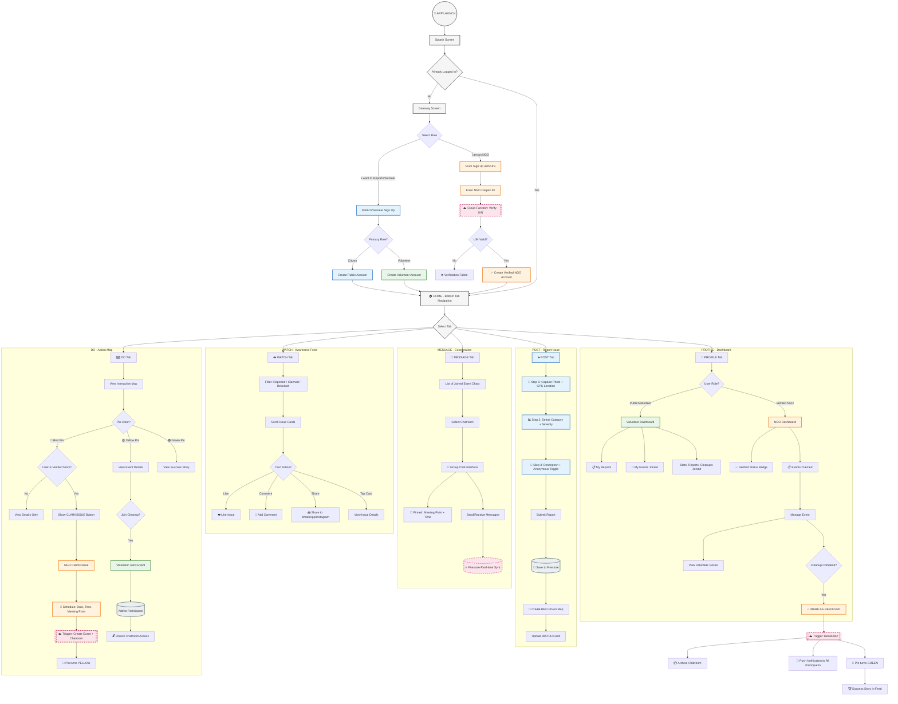
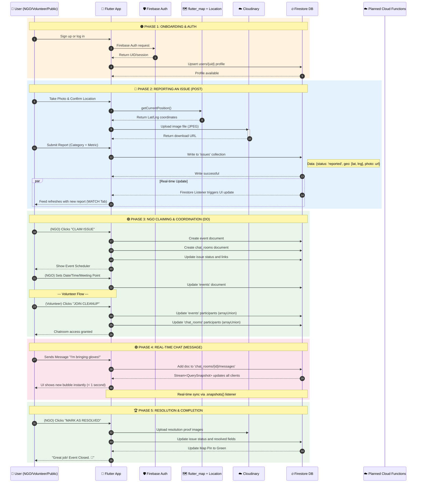

# Red2Green - Software Requirements Specification (SRS) Document

## 1. Abstract (200-250 words)
Red2Green is a community-driven mobile platform that connects citizens, volunteers, and NGOs to improve urban cleanliness through structured, technology-enabled collaboration. Designed for Indian cities, the app addresses persistent challenges such as garbage accumulation, potholes, drainage issues, and damaged public infrastructure by enabling instant issue reporting with photos and geo-location. Citizens can capture and submit issues in seconds, while NGOs and volunteers can discover, claim, and coordinate cleanup activities in real time.

The platform promotes transparency with a public feed and a live map of issues, showing status transitions from Reported to Claimed to Resolved. Red2Green incorporates event scheduling, volunteer roster management, and group chatrooms to streamline logistics and reduce coordination delays. Built using Flutter and Firebase, the solution offers a performant experience on Android with real-time Firestore updates and Firebase Auth for secure sign-in. Current orchestration is handled in the Flutter service layer, while Cloud Functions and advanced notification automation are documented as production roadmap items. By integrating user-friendly reporting, transparent tracking, and coordinated action, Red2Green transforms citizen engagement into measurable outcomes, accelerates response times, and fosters accountability among stakeholders—ultimately contributing to cleaner neighborhoods and stronger civic participation.

## 2. Problem Statement
""

"NGOs and volunteers aim to solve urban cleanliness, infrastructure, and environmental issues, but the lack of structured coordination prevents them from acting together effectively.
"

Unreported Urban Issues:
Urban areas face increasing cleanliness issues such as garbage accumulation, potholes, and damaged public infrastructure. Citizens often have no simple and effective platform to report these problems, resulting in delays or complete lack of action. At the same time, volunteers and NGOs struggle to identify issues in real time and coordinate cleanup activities efficiently.

Disjointed Coordination:
At the same time, NGOs and volunteer groups primarily rely on social media platforms such as Instagram and WhatsApp to announce cleanup campaigns. These platforms only reach audiences after campaigns are posted, offer limited visibility before execution, and do not support issue discovery, volunteer coordination, task tracking, or post-resolution validation. As a result, volunteer mobilization is unstructured, efforts are fragmented, and accountability remains low.

Inefficient Resolution:
Existing social media platforms provide awareness but lack structured tools for resolution, task assignment, collaboration, and accountability in maintaining urban cleanliness.

Existing social media platforms help raise awareness but do not provide structured tools for resolution, task assignment, or collaboration. This leads to poor communication, unorganized efforts, and a lack of accountability in maintaining urban cleanliness.

Therefore, there is a need for a dedicated mobile application that connects citizens, volunteers, and NGOs to report issues, organize cleanup activities, and track progress in an efficient and transparent manner.

## 3. Significance of the Study
The Red2Green project is significant because it provides an effective, technology-driven solution to a wide range of urban civic problems—not limited to cleanliness alone, but addressing all types of infrastructure and public space issues including potholes, drainage blockages, damaged street furniture, illegal posters, stray animal concerns, tree hazards, and water leakage. By enabling citizens to report any civic issue instantly and allowing volunteers and NGOs to coordinate resolution efforts, the app strengthens community participation and improves the overall quality of urban life. The platform promotes transparency through real-time tracking of reported issues, enhances communication among stakeholders, and helps local organizations utilize resources more efficiently across diverse problem categories.

## 4. Key Features
### 4.1 Complaint Reporting
- Upload photos and locations of overflowing bins or litter to alert authorities
- Geo-tagged issue submission with category and severity metrics
- Anonymous reporting option

### 4.2 Waste Management
- Helps with e-waste collection, sorting, and tracking
- Categorized issue types: Garbage, Pothole, Drainage, Broken Street Property, Illegal Posters, Stray Animals, Tree Hazards, Water Leakage

### 4.3 Citizen Engagement
- Awards points for reporting issues, redeemable for rewards like vouchers or phone top-ups
- Social features: Like, Comment, Share posts
- Community feed for awareness

### 4.4 Status Updates
- Provides notifications on complaint resolution
- Real-time status tracking: Reported → Claimed → Resolved
- Push notifications for issue updates

### 4.5 Collector/NGO Tools
- Separate dashboard for NGOs to claim and manage issues
- Event scheduling with date, time, meeting point
- Volunteer roster management
- Mark as Resolved functionality

## 5. Expected Results (Quantitative)
| Metric                                                     | Expected Improvement         |
|------------------------------------------------------------|------------------------------|
| Increase in issues reported by citizens                    | 40–60% within first 3 months |
| Reduction in time to identify/address issues               | 30–50%                       |
| Faster coordination between volunteers and NGOs            | 25–40%                       |
| Improvement in volunteer participation                     | 50–70%                       |
| Increase in issues resolved (Reported → Claimed → Resolved)| 20–35%                       |
| Rise in community engagement (likes, comments, shares)     | 30–45%                       |
| Reduction in reoccurring cleanliness issues                | 15–25%                       |
| Accuracy in issue mapping using geo-tagging                | 90%+                         |
| User satisfaction rate                                     | 80%+                         |
| Active NGOs and volunteers in first year                   | 50+ NGOs, 500+ volunteers    |

## 6. User Roles & Permissions
### 6.1 Public User (Citizen Reporter)
- Report issues with photo, location, category, severity
- View WATCH feed
- Like, comment, share posts
- Track status of reported issues
- Share to external social media

### 6.2 Volunteer
- All Public User permissions
- View DO map with issue pins
- Join cleanup events
- Access MESSAGE chatrooms for joined events
- Coordinate with NGOs and other volunteers

### 6.3 Verified NGO
- All Volunteer permissions
- Claim reported issues
- Schedule cleanup events (date, time, meeting point)
- Create and manage event chatrooms
- Mark issues as Resolved
- Manage volunteer roster
- Requires NGO Darpan ID (UIN) verification

## 7. Functional Modules (5 Core Tabs)
### 7.1 WATCH (Home Feed)
Purpose: Awareness and Engagement

**Components:**
- Top Bar: App logo, Location selector, Notifications icon
- Status Filter Bar: [Reported] [Claimed] [Resolved]
- Scrollable Issue Card Feed

**Issue Card Elements:**
- Header: User avatar, name, timestamp
- Main Image: Full-width photo of issue
- Status Tag: Color-coded (Red/Yellow/Green)
- Issue Details: Category, Metric/Severity, Location
- Social Bar: Like, Comment, Share icons
- Description: 1-2 line preview

**User Actions:**
- Scroll through feed
- Tap card to view details
- Filter by status
- Share to WhatsApp/Instagram

### 7.2 DO (Action Map)
Purpose: Visualization and Action Coordination

**Components:**
- Top Bar: Search bar, Filter icon
- Full-screen Interactive Map (Google Maps)
- Color-coded Map Pins
- Sliding Detail Panel (bottom drawer)
- Bottom Tab Bar

**Pin Color Logic:**
- 🔴 Red Pin: Reported (Open for claiming)
- 🟡 Yellow Pin: Claimed (Event scheduled)
- 🟢 Green Pin: Resolved (Completed)

**NGO Flow (Red Pin):**
1. Tap Red Pin → View issue details
2. Click "CLAIM ISSUE" button
3. System changes status to Claimed
4. Pin turns Yellow
5. Chatroom created automatically
6. Redirect to Event Scheduler

**Volunteer Flow (Yellow Pin):**
1. Tap Yellow Pin → View event details
2. See NGO name, Date/Time, Meeting point
3. Click "JOIN CLEANUP EVENT"
4. Added to volunteer roster
5. Access to chatroom granted

### 7.3 POST (Report Issue)
Purpose: Data Input/Issue Reporting

**3-Step Flow:**

Step 1: Capture & Locate
- Camera/Gallery button for photo upload
- Interactive map with pin dropper
- Auto-detect GPS location
- Manual location refinement option

Step 2: Categorize & Quantify
- Issue Category Selection (Grid of icons):
  - Garbage/Waste: Volume (Low/Medium/High)
  - Pothole/Road Damage: Size (Small/Medium/Big)
  - Broken Street Property: Type & Status
  - Illegal Posters/Graffiti: Length/Area
  - Drainage/Sewage: Type of blockage
  - Stray Animal Hazard: Type & Count
  - Tree/Greenery Hazard: Status & Scale
  - Water Leakage: Source & Flow

Step 3: Detail & Submit
- Title/Summary input
- Description text area
- "Report Anonymously" toggle
- "SUBMIT REPORT" button

**Post-Submission:**
- Confirmation message
- Redirect to WATCH feed
- New report appears at top

### 7.4 MESSAGE (Coordination Hub)
Purpose: Real-time Logistics and Planning

**Key Rules:**
- NO personal 1-on-1 chat
- Group chat ONLY
- Chatroom created when NGO claims issue
- Access granted only after clicking "Join Cleanup"
- Archived when issue marked Resolved

**Screen A: Chat List**
- Header: "Cleanup Coordination"
- Search/Filter icon
- List of chatrooms user is member of
- Each item shows: Event title, Status (Active/Archived), Participant count, Last message snippet

**Screen B: Chatroom**
- Header: Event title, Event details link
- Pinned message banner (Meeting point/time)
- Message bubbles (left: others, right: self)
- Input bar with text field
- Attachment icon (optional)
- Send button
- "Leave Chat" option

### 7.5 PROFILE (Dashboard)
Purpose: History and Account Management

**Common Elements:**
- Settings icon (gear)
- User avatar and name
- Role badge (Public/Volunteer/Verified NGO)
- Activity metrics

**Public/Volunteer View:**
- Stats: Reports Submitted, Cleanups Joined, Events Shared
- Tabs: "My Reports", "My Events"
- My Reports: List of submitted issues with status
- My Events: List of joined cleanup events with chatroom links

**Verified NGO View:**
- Stats: Issues Claimed, Issues Resolved, Volunteer Roster count
- Tabs: "My Reports", "Events Claimed"
- Verification Status indicator (Verified ✅ / Pending 🟡)
- Events Claimed: Management dashboard
  - Each event shows: Volunteer count, "MARK AS RESOLVED" button

## 8. Onboarding & Authentication
### 8.1 Gateway Screen (First Launch)
- App logo and value proposition
- Two buttons:
  1. "I want to Report or Volunteer" → Public/Volunteer path
  2. "I am an NGO/Organizer" → NGO path

### 8.2 Public/Volunteer Registration
- Fields: Full Name, Email, Phone, Password
- Role selector toggle: "Citizen Reporter" / "Active Volunteer"
- Location permission request
- "Create Account" button
- Lands on WATCH feed after registration

### 8.3 NGO Registration (Verification Funnel)
- Fields: Organization Name, Contact Person, Email, Phone
- Critical field: NGO Darpan ID (UIN) with info icon
- Helper text: "Required for official verification"
- "Verify & Register" button
- Pending verification status screen
- Verification workflow defined as backend roadmap item
- Verification success unlocks Claim/Message features

### 8.4 Login Screen
- Email/Phone input
- Password input
- "Forgot Password?" link
- "Log In" button
- Social login options: Google (Phone OTP is roadmap)

## 9. Technical Architecture
### 9.1 Tech Stack
| Component            | Technology                    | Purpose                                  |
|----------------------|-------------------------------|------------------------------------------|
| Mobile App (Frontend)| Flutter (Dart)                | Android Application                      |
| Backend & Database   | Firebase                      | Real-time database, authentication       |
| Database             | Cloud Firestore (NoSQL)       | Feed, Chat, User data                    |
| Authentication       | Firebase Auth                 | Email/password, Google Sign-in, password reset |
| Media Storage        | Cloudinary                    | Image hosting for issue photos           |
| Maps                | flutter_map + OpenStreetMap    | Interactive map for DO screen            |
| Location             | geolocator + latlong2          | GPS and map coordinate handling          |
| Backend Logic        | Client-side service layer      | Issue/event/chat orchestration           |
| Push Notifications   | FCM dependency present         | Not fully wired in current app flows     |
| External API         | NGO Darpan API                 | Planned verification workflow            |

### 9.2 Database Schema (Firestore Collections)

#### Collection: users
```json
{
  "uid": "string (doc id)",
  "email": "string",
  "displayName": "string",
  "photoUrl": "string (nullable)",
  "role": "public | volunteer | ngo",
  "isVerified": "boolean (default false)",
  "ngoUin": "string (nullable)",
  "ngoName": "string (nullable)",
  "phone": "string (nullable)",
  "fcmToken": "string (nullable)",
  "createdAt": "Timestamp",
  "stats": {
    "reports_count": "number",
    "events_joined": "number",
    "issues_claimed": "number (ngo)",
    "issues_resolved": "number (ngo)",
    "volunteer_count": "number (ngo)"
  }
}
```

#### Collection: issues
```json
{
  "id": "string (doc id)",
  "reporterId": "string",
  "reporterName": "string",
  "reporterPhotoUrl": "string (nullable)",
  "location": "GeoPoint {latitude, longitude}",
  "photoUrl": "string",
  "category": "string",
  "severity": "string",
  "title": "string",
  "description": "string",
  "status": "reported | claimed | resolved",
  "claimedByNgoId": "string (nullable)",
  "claimedByNgoName": "string (nullable)",
  "eventId": "string (nullable)",
  "chatRoomId": "string (nullable)",
  "createdAt": "Timestamp",
  "resolvedAt": "Timestamp (nullable)",
  "resolvedImages": ["string"],
  "isAnonymous": "boolean",
  "likes": ["userId"],
  "commentCount": "number"
}
```

#### Collection: events
```json
{
  "id": "string (doc id)",
  "issueId": "string",
  "ngoId": "string",
  "ngoName": "string",
  "chatRoomId": "string (nullable)",
  "scheduledTime": "Timestamp (nullable)",
  "meetingPoint": "string (nullable)",
  "participants": ["userId"],
  "isActive": "boolean",
  "createdAt": "Timestamp"
}
```

#### Collection: chat_rooms
```json
{
  "id": "string (doc id)",
  "eventId": "string",
  "issueId": "string",
  "ngoId": "string",
  "ngoName": "string",
  "title": "string",
  "createdAt": "Timestamp",
  "participants": ["userId"],
  "lastMessage": "string (nullable)",
  "lastMessageTime": "Timestamp (nullable)"
}
```

##### Sub-collection: messages
```json
{
  "senderId": "string",
  "senderName": "string",
  "text": "string",
  "timestamp": "Timestamp",
  "photoUrl": "string (nullable)"
}
```

### 9.3 Cloud Functions
- Current implementation status: Cloud Functions package is included in dependencies, but the current app flow performs claim, event creation, chat-room creation, and resolve updates from the Flutter service layer (`database_service.dart`).
- Recommended production direction:
  - Move claim/unclaim/resolve orchestration to Cloud Functions for stronger authorization and transactional consistency.
  - Move external verification and notification workflows to server-side functions.

## 10. Technology Stack (Detailed)
This section provides a comprehensive breakdown of all technologies, packages, and architectural decisions for the Red2Green application.

### 10.1 Technology Stack Overview

#### 10.1.1 Frontend (Mobile Application)

| Component        | Technology          | Purpose                                         |
|------------------|---------------------|-------------------------------------------------|
| Framework        | Flutter (Dart)      | Android app, native performance, excellent map support |
| UI Library       | Material Design 3   | Native-looking components with custom theming   |
| State Management | Provider            | Manage app state (auth, issues, chats) across screens |
| Navigation       | Navigator + IndexedStack | Tab and stack navigation for 5-tab structure |

#### 10.1.2 Backend & Database (Firebase/Google Cloud)

| Component         | Technology                | Purpose                                      |
|-------------------|---------------------------|----------------------------------------------|
| Database          | Cloud Firestore (NoSQL)   | Real-time database for Feed, Chat, User data |
| Authentication    | Firebase Auth             | Email/password and Google Sign-in             |
| Media Storage     | Cloudinary                | Image hosting for issue photos               |
| Backend Logic     | Flutter service layer + Firestore writes | Orchestration in current implementation |
| Push Notifications| FCM dependency present | Notification flows not fully wired in code |

#### 10.1.3 Maps & Location

| Component        | Technology              | Purpose                           |
|------------------|-------------------------|-----------------------------------|
| Maps SDK         | flutter_map             | Interactive map for DO screen     |
| Location Services| Geolocator Package      | GPS position for reporting        |
| Coordinate Model | latlong2                | Map coordinate handling           |

#### 10.1.4 External APIs

| Component        | Technology          | Purpose                             |
|------------------|---------------------|-------------------------------------|
| NGO Verification | NGO Darpan API (planned) | UIN verification roadmap |

### 10.2 Essential Flutter Packages (pubspec.yaml)

```yaml
dependencies:
  # Core Firebase
  firebase_core: ^3.8.0
  cloud_firestore: ^5.5.0
  firebase_auth: ^5.3.3
  firebase_messaging: ^15.1.5
  cloud_functions: ^5.3.3
  google_sign_in: ^6.2.1

  # Maps & Location
  flutter_map: ^7.0.2
  latlong2: ^0.9.1
  geolocator: ^10.1.0

  # State Management & Navigation
  provider: ^6.1.1

  # UI & Media
  image_picker: ^1.0.7
  cached_network_image: ^3.3.1
  flutter_local_notifications: ^18.0.0
  cloudinary_flutter: ^1.3.0
  cloudinary_url_gen: ^1.6.0
  image: ^4.1.3
  path_provider: ^2.1.1

  # Utilities
  intl: ^0.19.0
  url_launcher: ^6.2.2
  share_plus: ^7.2.1
  http: ^1.1.0
```

### 10.3 Project Structure

```plaintext
lib/
├── main.dart                 # Entry point, Firebase initialization
├── models/                   # Data structures
│   ├── user_model.dart       # User, Volunteer, NGO models
│   ├── issue_model.dart      # IssueReport model
│   ├── event_model.dart      # Cleanup Event model
│   └── message_model.dart    # Chat message model
├── services/                 # API & Business Logic
│   ├── auth_service.dart     # Firebase Auth wrapper
│   ├── database_service.dart # Firestore CRUD operations
│   ├── storage_service.dart  # Image upload/download
│   ├── location_service.dart # GPS & Geolocation
│   └── notification_service.dart # FCM handling
├── providers/                # State Management
│   ├── auth_provider.dart    # User authentication state
│   ├── issue_provider.dart   # Issues state
│   └── chat_provider.dart    # Chat state
├── widgets/                  # Reusable UI Components
│   ├── issue_card.dart       # Feed card widget
│   ├── status_tag.dart       # Red/Yellow/Green badges
│   ├── map_pin.dart          # Custom map markers
│   └── chat_bubble.dart      # Message bubbles
└── screens/
    ├── wrapper.dart          # Auth flow decision
    ├── auth/
    │   ├── gateway_screen.dart    # Role selection
    │   ├── login_screen.dart      # Login form
    │   ├── register_screen.dart   # Public/Volunteer signup
    │   └── ngo_verify_screen.dart # NGO UIN verification
    ├── home/
    │   └── home_screen.dart       # Bottom Tab Controller
    ├── watch/
    │   ├── watch_screen.dart      # Feed screen
    │   └── issue_detail_screen.dart # Issue detail
    ├── do_map/
    │   ├── do_screen.dart         # Map view
    │   ├── claim_sheet.dart       # NGO claim modal
    │   └── join_sheet.dart        # Volunteer join modal
    ├── post/
    │   ├── post_screen.dart       # Step 1: Capture
    │   ├── categorize_screen.dart # Step 2: Category
    │   └── submit_screen.dart     # Step 3: Details
    ├── message/
    │   ├── chat_list_screen.dart  # Chat list
    │   └── chat_room_screen.dart  # Individual chat
    └── profile/
        ├── profile_screen.dart    # Dashboard
        ├── my_reports_screen.dart # User's reports
        └── my_events_screen.dart  # User's events
```

### 10.4 Why This Stack?

| Requirement       | Solution                              | Reasoning                                           |
|-------------------|---------------------------------------|-----------------------------------------------------|
| Performance       | Flutter                               | Native Android performance, excellent map support |
| Real-time updates | Firestore                             | Built-in real-time listeners, offline support        |
| Geo-location      | Google Maps + Geolocator             | Industry standard, seamless integration             |
| Image-heavy feed  | Cloudinary + Cached Network Image     | Fast loading, automatic caching                     |
| Chat functionality| Firestore                             | Real-time, no need for separate chat backend         |
| Push notifications| FCM                                   | Free, reliable, integrated with Firebase            |
| Server-side logic | Cloud Functions                       | Secure API calls, automated triggers                |
| Authentication    | Firebase Auth                         | Multiple providers, secure, easy implementation     |

## 11. Unified App Flow Diagram
This section presents a comprehensive flow diagram showing how all user types navigate through the application from a common starting point, then branch based on their roles.

### 11.1 App Flow Diagram (Mermaid)

```mermaid
graph TD
    %% ============ COMMON START FOR ALL USERS ============
    Start((🚀 APP LAUNCH)) --> Splash[Splash Screen]
    Splash --> AuthCheck{Already Logged In?}

    AuthCheck -- No --> Gateway[Gateway Screen]

    Gateway --> RoleSelect{Select Role}

    %% ============ REGISTRATION BRANCHES ============
    RoleSelect -- "I want to Report/Volunteer" --> PublicSignUp[Public/Volunteer Sign Up]
    RoleSelect -- "I am an NGO" --> NGOSignUp[NGO Sign Up with UIN]

    PublicSignUp --> RoleToggle{Primary Role?}
    RoleToggle -- Citizen --> CreatePublic[Create Public Account]
    RoleToggle -- Volunteer --> CreateVolunteer[Create Volunteer Account]

    NGOSignUp --> UINInput[Enter NGO Darpan ID]
    UINInput --> APIVerify[[☁️ Cloud Function: Verify UIN]]
    APIVerify --> VerifyCheck{UIN Valid?}
    VerifyCheck -- No --> RejectNGO[❌ Verification Failed]
    VerifyCheck -- Yes --> CreateNGO[✅ Create Verified NGO Account]

    %% ============ ALL USERS LAND ON HOME ============
    CreatePublic --> Home[🏠 HOME - Bottom Tab Navigation]
    CreateVolunteer --> Home
    CreateNGO --> Home
    AuthCheck -- Yes --> Home

    %% ============ HOME TABS - COMMON FOR ALL ============
    Home --> TabBar{Select Tab}
    TabBar --> WATCH[👁️ WATCH Tab]
    TabBar --> DO[🗺️ DO Tab]
    TabBar --> POST[➕ POST Tab]
    TabBar --> MESSAGE[💬 MESSAGE Tab]
    TabBar --> PROFILE[👤 PROFILE Tab]

    %% ============ WATCH TAB - ALL USERS ============
    subgraph WATCH_FLOW [WATCH - Awareness Feed]
        WATCH --> FilterBar[Filter: Reported / Claimed / Resolved]
        FilterBar --> ScrollFeed[Scroll Issue Cards]
        ScrollFeed --> CardAction{Card Action?}
        CardAction -- Like --> LikePost[❤️ Like Issue]
        CardAction -- Comment --> CommentPost[💬 Add Comment]
        CardAction -- Share --> SharePost[📤 Share to WhatsApp/Instagram]
        CardAction -- Tap Card --> IssueDetail[View Issue Details]
    end

    %% ============ POST TAB - PUBLIC/VOLUNTEER ============
    subgraph POST_FLOW [POST - Report Issue]
        POST --> Step1[📸 Step 1: Capture Photo + GPS Location]
        Step1 --> Step2[📊 Step 2: Select Category + Severity]
        Step2 --> Step3[📝 Step 3: Description + Anonymous Toggle]
        Step3 --> SubmitReport[Submit Report]
        SubmitReport --> SaveDB[(💾 Save to Firestore)]
        SaveDB --> CreateRedPin[📍 Create RED Pin on Map]
        CreateRedPin --> NotifyFeed[Update WATCH Feed]
    end

    %% ============ DO TAB - ROLE-BASED BRANCHING ============
    subgraph DO_FLOW [DO - Action Map]
        DO --> MapView[View Interactive Map]
        MapView --> PinType{Pin Color?}

        %% RED PIN - NGO ONLY
        PinType -- 🔴 Red Pin --> CheckNGO{User is Verified NGO?}
        CheckNGO -- No --> ViewOnly[View Details Only]
        CheckNGO -- Yes --> ClaimOption[Show CLAIM ISSUE Button]
        ClaimOption --> ClaimIssue[NGO Claims Issue]
        ClaimIssue --> ScheduleEvent[📅 Schedule: Date, Time, Meeting Point]
        ScheduleEvent --> TriggerEvent[[☁️ Trigger: Create Event + Chatroom]]
        TriggerEvent --> UpdateYellow[📍 Pin turns YELLOW]

        %% YELLOW PIN - VOLUNTEER
        PinType -- 🟡 Yellow Pin --> ViewEvent[View Event Details]
        ViewEvent --> JoinOption{Join Cleanup?}
        JoinOption -- Yes --> JoinEvent[Volunteer Joins Event]
        JoinEvent --> AddToRoster[(Add to Participants)]
        AddToRoster --> UnlockChat[🔓 Unlock Chatroom Access]

        %% GREEN PIN - ALL USERS
        PinType -- 🟢 Green Pin --> ViewSuccess[View Success Story]
    end

    %% ============ MESSAGE TAB - PARTICIPANTS ONLY ============
    subgraph MESSAGE_FLOW [MESSAGE - Coordination]
        MESSAGE --> ChatList[List of Joined Event Chats]
        ChatList --> SelectChat[Select Chatroom]
        SelectChat --> ChatRoom[💬 Group Chat Interface]
        ChatRoom --> PinnedInfo[📌 Pinned: Meeting Point + Time]
        ChatRoom --> SendMessage[Send/Receive Messages]
        SendMessage --> RealtimeSync[(🔥 Firestore Real-time Sync)]
    end

    %% ============ PROFILE TAB - ROLE-BASED VIEWS ============
    subgraph PROFILE_FLOW [PROFILE - Dashboard]
        PROFILE --> ProfileType{User Role?}

        %% PUBLIC/VOLUNTEER PROFILE
        ProfileType -- Public/Volunteer --> VolProfile[Volunteer Dashboard]
        VolProfile --> MyReports[📋 My Reports]
        VolProfile --> MyEvents[📅 My Events Joined]
        VolProfile --> VolStats[Stats: Reports, Cleanups Joined]

        %% NGO PROFILE
        ProfileType -- Verified NGO --> NGOProfile[NGO Dashboard]
        NGOProfile --> VerifyBadge[✅ Verified Status Badge]
        NGOProfile --> ClaimedEvents[📋 Events Claimed]
        ClaimedEvents --> ManageEvent[Manage Event]
        ManageEvent --> VolunteerCount[View Volunteer Roster]
        ManageEvent --> ResolveOption{Cleanup Complete?}
        ResolveOption -- Yes --> MarkResolved[✅ MARK AS RESOLVED]
    end

    %% ============ RESOLUTION FLOW ============
    MarkResolved --> TriggerResolve[[☁️ Trigger: Resolution]]
    TriggerResolve --> UpdateGreen[📍 Pin turns GREEN]
    TriggerResolve --> ArchiveChat[📦 Archive Chatroom]
    TriggerResolve --> SendNotify[🔔 Push Notification to All Participants]
    UpdateGreen --> SuccessStory[🏆 Success Story in Feed]

    %% ============ STYLING ============
    classDef common fill:#f5f5f5,stroke:#333,stroke-width:2px
    classDef public fill:#e3f2fd,stroke:#1565c0,stroke-width:2px
    classDef volunteer fill:#e8f5e9,stroke:#2e7d32,stroke-width:2px
    classDef ngo fill:#fff3e0,stroke:#ef6c00,stroke-width:2px
    classDef system fill:#fce4ec,stroke:#c2185b,stroke-width:2px,stroke-dasharray: 5 5
    classDef database fill:#eceff1,stroke:#455a64,stroke-width:2px

    class Start,Splash,AuthCheck,Gateway,Home,TabBar common
    class PublicSignUp,CreatePublic,POST,Step1,Step2,Step3 public
    class CreateVolunteer,JoinEvent,VolProfile volunteer
    class NGOSignUp,UINInput,CreateNGO,ClaimIssue,ScheduleEvent,NGOProfile,MarkResolved ngo
    class APIVerify,TriggerEvent,TriggerResolve,RealtimeSync system
    class SaveDB,AddToRoster database
```

### 11.2 Technical Sequence Diagram (Mermaid)
This sequence diagram shows the technical interaction between the User, Flutter App, and current backend services (Firebase, Cloudinary, and Firestore) across all 5 phases of the application lifecycle.

**Participants Legend:**

- User: The human actor (Citizen, Volunteer, or NGO)  
- App: 📱 Flutter Android App  
- Auth: 🛡️ Firebase Authentication  
- Maps: 🗺️ flutter_map + device location services  
- Storage: ☁️ Cloudinary  
- DB: 🔥 Cloud Firestore Database  
- Cloud: ☁️ Planned Cloud Functions (roadmap)  


```mermaid
sequenceDiagram
    autonumber

    %% ============ PARTICIPANTS ============
    participant User as 👤 User (NGO/Volunteer/Public)
    participant App as 📱 Flutter App
    participant Auth as 🛡️ Firebase Auth
    participant Maps as 🗺️ flutter_map + Location
    participant Storage as ☁️ Cloudinary
    participant DB as 🔥 Firestore DB
    participant Cloud as ☁️ Planned Cloud Functions

    %% ============ PHASE 1: ONBOARDING & AUTH ============
    rect rgb(255, 243, 224)
    Note over User, DB: 🟠 PHASE 1: ONBOARDING & AUTH

    User->>App: Sign up or log in
    App->>Auth: Firebase Auth request
    Auth-->>App: Return UID/session
    App->>DB: Upsert users/{uid} profile
    DB-->>App: Profile available
    end

    %% ============ PHASE 2: REPORTING AN ISSUE (POST) ============
    rect rgb(227, 242, 253)
    Note over User, DB: 🔵 PHASE 2: REPORTING AN ISSUE (POST)

    User->>App: Take Photo & Confirm Location
    App->>Maps: getCurrentPosition()
    Maps-->>App: Return Lat/Lng coordinates
    App->>Storage: Upload image file (JPEG)
    activate Storage
    Storage-->>App: Return download URL
    deactivate Storage
    User->>App: Submit Report (Category + Metric)
    App->>DB: Write to 'issues' collection
    Note right of DB: Data: {status: 'reported', geo: [lat, lng], photo: url}
    DB-->>App: Write successful

    par Real-time Update
        DB-->>App: Firestore Listener triggers UI update
        App-->>User: Feed refreshes with new report (WATCH Tab)
    end
    end

    %% ============ PHASE 3: NGO CLAIMING & COORDINATION (DO) ============
    rect rgb(232, 245, 233)
    Note over User, DB: 🟢 PHASE 3: NGO CLAIMING & COORDINATION (DO)

    User->>App: (NGO) Clicks "CLAIM ISSUE"
    App->>DB: Create event document
    App->>DB: Create chat_rooms document
    App->>DB: Update issue status and links

    App-->>User: Show Event Scheduler
    User->>App: (NGO) Sets Date/Time/Meeting Point
    App->>DB: Update 'events' document

    Note over User, App: --- Volunteer Flow ---
    User->>App: (Volunteer) Clicks "JOIN CLEANUP"
    App->>DB: Update 'events' participants (arrayUnion)
    App->>DB: Update 'chat_rooms' participants (arrayUnion)
    App-->>User: Chatroom access granted
    end

    %% ============ PHASE 4: REAL-TIME CHAT (MESSAGE) ============
    rect rgb(252, 228, 236)
    Note over User, DB: 🟣 PHASE 4: REAL-TIME CHAT (MESSAGE)

    User->>App: Sends Message "I'm bringing gloves!"
    App->>DB: Add doc to 'chat_rooms/{id}/messages'
    DB-->>App: Stream<QuerySnapshot> updates all clients
    App-->>User: UI shows new bubble instantly (< 1 second)
    Note over App, DB: Real-time sync via .snapshots() listener
    end

    %% ============ PHASE 5: RESOLUTION & COMPLETION ============
    rect rgb(232, 245, 233)
    Note over User, DB: 🏆 PHASE 5: RESOLUTION & COMPLETION

    User->>App: (NGO) Clicks "MARK AS RESOLVED"
    App->>Storage: Upload resolution proof images
    App->>DB: Update issue status and resolved fields

    DB-->>App: Update Map Pin to Green
    App-->>User: "Great job! Event Closed. 🎉"
    end
```

#### 11.2.1 Sequence Diagram Phase Breakdown

| Phase | Color      | Description                 | Key Technical Actions                          |
|-------|------------|-----------------------------|-----------------------------------------------|
| 1     | 🟠 Orange  | Onboarding and Auth         | Firebase Auth → users profile write/update |
| 2     | 🔵 Blue    | Issue Reporting             | Maps API → Cloudinary Upload → Firestore Write |
| 3     | 🟢 Green   | Claiming & Coordination     | App service creates Event + Chatroom + issue links |
| 4     | 🟣 Purple  | Real-time Chat              | Firestore Streams → Instant UI Updates         |
| 5     | 🏆 Green   | Resolution                  | App service resolves issue with proof images |

#### 11.2.2 Technical Explanation
1. **Verification (The Security Layer)**  
  NGO verification is a planned backend workflow. Current role behavior is driven by app flow and should be reinforced by Firestore rules.

2. **Reporting (The Data Layer)**  
  Two-step save: Images → Cloudinary, Metadata → Firestore. GPS coordinates from device location services. Photo URL stored as string reference.

3. **Real-time Listeners (WATCH Feed)**  
   Flutter `StreamBuilder` creates persistent connection. Any new report instantly updates ALL connected devices. No manual refresh needed.

4. **Claim and Event Setup (Current Implementation)**  
  The Flutter service layer creates event and chat room records, then updates the issue with linkage fields.

5. **Chat (Firestore Real-time)**  
  Messages stored as sub-collection: `chat_rooms/{chatRoomId}/messages/{messageId}`. `.snapshots()` creates a persistent realtime connection. Sync latency is typically under one second.

6. **Resolution (Cleanup)**  
  Status changes to resolved, `resolvedAt` is set, and proof image URLs are stored in `resolvedImages`.

### 11.3 Flow Diagram Explanation
**Common Entry Point (All Users):**  
1. App Launch → Splash Screen → Auth Check  
2. If not logged in → Gateway Screen → Role Selection  
3. All paths converge at HOME (Bottom Tab Navigation)

**Role-Based Branching:**

| Flow Section       | Public User       | Volunteer           | Verified NGO            |
|--------------------|-------------------|---------------------|-------------------------|
| WATCH              | View, Like, Share | View, Like, Share   | View, Like, Share       |
| POST               | Report Issues     | Report Issues       | Report Issues           |
| DO (Red Pin)       | View Only         | View Only           | CLAIM ISSUE             |
| DO (Yellow Pin)    | View Only         | JOIN CLEANUP        | Manage Event            |
| MESSAGE            | No Access         | Access Joined Chats | Access + Manage Chats   |
| PROFILE            | My Reports        | My Reports + Events | Events Claimed + Resolve|

**Key Decision Points:**  
- 🔴 Red Pin: Only Verified NGOs can claim  
- 🟡 Yellow Pin: Volunteers can join, NGOs manage  
- 🟢 Green Pin: All users view success stories  

**System Automation Status:**  
- Current: App service layer performs claim, join, chat, and resolve orchestration  
- Roadmap: Move critical orchestration to Cloud Functions for stronger authorization and consistency  

## 12. WORKFLOW DIAGRAMS
### 12.1 Issue Lifecycle (State Diagram)
```
[START] → [REPORTED (Red Pin)] → [CLAIMED (Yellow Pin)] → [RESOLVED (Green Pin)] → [ARCHIVED]
```
**States:**  
- **REPORTED:** Visible on map, open for claiming  
- **CLAIMED:** Event scheduled, chatroom active, volunteers can join  
- **RESOLVED:** Success story, chatroom read-only  
- **ARCHIVED:** After 30 days (auto)  

### 12.2 Master Workflow Table
| Phase        | Step | Actor     | Action                     | System Outcome                         |
|--------------|------|-----------|----------------------------|----------------------------------------|
| Onboarding   | 1.1  | Public    | Sign Up                    | Account created, Role = Public         |
| Onboarding   | 1.2  | NGO       | Sign Up with NGO details   | NGO account created (verification workflow is roadmap) |
| Reporting    | 2.1  | Public    | Submit Report (POST)       | Red Pin on Map, Feed Updated           |
| Claiming     | 3.1  | NGO       | Tap Red Pin → "Claim"      | Pin turns Yellow, Chatroom Created     |
| Scheduling   | 3.2  | NGO       | Set Date/Time              | Event details visible on Map           |
| Joining      | 4.1  | Volunteer | Tap Yellow Pin → "Join"    | Added to Roster, Added to Chatroom     |
| Coordination | 5.1  | All       | Send Messages              | Realtime message sync to participants  |
| Resolution   | 6.1  | NGO       | "Mark as Resolved"         | Pin turns Green, proof images stored   |

## 13. UI/UX GUIDELINES
### 13.1 Visual Style
- Theme: Eco-friendly, Civic-minded, Modern, Clean
- Design: Minimalist with high readability

### 13.2 Color Palette
| Color                  | Hex Code | Usage                           |
|------------------------|----------|---------------------------------|
| Primary (Emerald Green)| #2ECC71  | Action buttons, active states, success |
| Secondary (Amber)      | #F1C40F  | Claimed/In-progress states      |
| Alert (Red)            | #E74C3C  | Reported/Unresolved states     |
| Background             | #FFFFFF  | Main background               |
| Section Dividers       | #F5F5F5  | Light grey separators         |
| Text (Dark Grey)       | #333333  | Primary text                  |

### 13.3 Typography
- Font Family: Sans-serif (Inter or Roboto) — High legibility, bold headers

### 13.4 Icons
- Filled icons for active tabs
- Outlined icons for inactive tabs
- Rounded corners (12-16px radius)

## 14. SECURITY CONSIDERATIONS
### 14.1 Authentication
- Firebase Auth handles identity
- Email/password and password reset supported
- Google Sign-in option

### 14.2 Database Security Rules
- Issues: Read (Everyone), Create (Authenticated), Update/Claim (Verified NGOs only)
- Events: Read (Everyone), Update/Join (Authenticated users)
- Chat Rooms: Read/Write (Only participants and NGO coordinator)

### 14.3 API Security
- Cloudinary signing secrets should not remain in the client in production
- Recommended architecture is server-side signing via Cloud Functions or secure backend API

## 15. Firestore Security Rules (Detailed)
### 15.1 Complete Security Rules
> Note: This is a target-state ruleset example and should be aligned with actual deployed rules.

```js
rules_version = '2';
service cloud.firestore {
  match /databases/{database}/documents {
    // ============ HELPER FUNCTIONS ============
    function isAuthenticated() {
      return request.auth != null;
    }
    function isOwner(userId) {
      return request.auth.uid == userId;
    }
    function isVerifiedNGO() {
      return isAuthenticated() && 
        get(/databases/$(database)/documents/users/$(request.auth.uid)).data.isVerified == true;
    }
    function isEventParticipant(eventId) {
      return isAuthenticated() && 
        request.auth.uid in get(/databases/$(database)/documents/events/$(eventId)).data.participants;
    }

    // ============ USERS COLLECTION ============
    // Read: Anyone can view user profiles
    // Write: Only the user can modify their own profile
    match /users/{userId} {
      allow read: if true;
      allow create: if isAuthenticated() && isOwner(userId);
      allow update: if isOwner(userId);
      allow delete: if false; // Users cannot delete accounts directly
    }

    // ============ ISSUES COLLECTION ============
    // Read: Public (everyone can see issues)
    // Create: Any authenticated user can report
    // Update (Claim): Only verified NGOs can claim
    // Update (Resolve): Only the NGO who claimed can resolve
    match /issues/{issueId} {
      allow read: if true;
      allow create: if isAuthenticated();
      allow update: if isAuthenticated() && (
        (request.resource.data.status == 'claimed' && isVerifiedNGO()) ||
        (request.resource.data.status == 'resolved' && resource.data.claimedByNgoId == request.auth.uid)
      );
      allow delete: if false;
    }

    // ============ EVENTS COLLECTION ============
    // Read: Public (everyone can see events)
    // Create: Only verified NGOs can create events
    // Update: NGO owner or participants (for joining)
    match /events/{eventId} {
      allow read: if true;
      allow create: if isVerifiedNGO();
      allow update: if isAuthenticated() && (
        resource.data.ngoId == request.auth.uid ||
        request.auth.uid in resource.data.participants
      );
      allow delete: if false;
    }

    // ============ CHAT ROOMS COLLECTION ============
    // Read/Write: Only event participants
    match /chat_rooms/{chatId} {
      allow read, write: if isEventParticipant(resource.data.eventId);

      // Messages sub-collection
      match /messages/{messageId} {
        allow read: if isEventParticipant(
          get(/databases/$(database)/documents/chat_rooms/$(chatId)).data.eventId
        );
        allow create: if isEventParticipant(
          get(/databases/$(database)/documents/chat_rooms/$(chatId)).data.eventId
        );
        allow update, delete: if false; // Messages cannot be edited or deleted
      }
    }
  }
}
```

### 15.2 Security Rules Summary
| Collection  | Read         | Create          | Update                        | Delete |
|-------------|--------------|-----------------|-------------------------------|--------|
| users       | Public       | Self only       | Self only                     | ❌     |
| issues      | Public       | Authenticated   | NGO (claim) / NGO (resolve)   | ❌     |
| events      | Public       | Verified NGO    | NGO + Participants            | ❌     |
| chat_rooms  | Participants | NGO claim flow (service layer) | Participants | ❌     |
| messages    | Participants | Participants    | ❌                           | ❌     |

## 16. REAL-TIME CHAT IMPLEMENTATION
### 16.1 How Chat Works (Firebase Real-time Sync)
**Concept:** Chat in Firebase is NOT "sending messages to phones" - it's saving documents to a shared database that all connected devices automatically sync with.

**Architecture:**
```
[User A Phone] ←→ [Cloud Firestore] ←→ [User B Phone]
                        ↑
                   Real-time Listener (.snapshots())
```

### 16.2 Sending a Message (Flutter Code)
```dart
import 'package:cloud_firestore/cloud_firestore.dart';
import 'package:firebase_auth/firebase_auth.dart';

class ChatService {
  final FirebaseFirestore _db = FirebaseFirestore.instance;
  final FirebaseAuth _auth = FirebaseAuth.instance;

  // Send a message to a chatroom
  Future<void> sendMessage(String chatRoomId, String text) async {
    final user = _auth.currentUser;
    if (user == null) return;
    await _db
        .collection('chat_rooms')
        .doc(chatRoomId)
        .collection('messages')
        .add({
      'text': text,
      'senderId': user.uid,
      'senderName': user.displayName ?? 'Anonymous',
      'timestamp': FieldValue.serverTimestamp(),
    });
  }
}
```

### 16.3 Receiving Messages (StreamBuilder)
```dart
import 'package:flutter/material.dart';
import 'package:cloud_firestore/cloud_firestore.dart';

class ChatRoomScreen extends StatelessWidget {
  final String chatRoomId;
  const ChatRoomScreen({required this.chatRoomId});
  @override
  Widget build(BuildContext context) {
    return StreamBuilder<QuerySnapshot>(
      stream: FirebaseFirestore.instance
          .collection('chat_rooms')
          .doc(chatRoomId)
          .collection('messages')
          .orderBy('timestamp', descending: false)
          .snapshots(),  // Real-time connection
      builder: (context, snapshot) {
        if (snapshot.connectionState == ConnectionState.waiting) {
          return const Center(child: CircularProgressIndicator());
        }
        if (snapshot.hasError) {
          return Center(child: Text('Error: ${snapshot.error}'));
        }
        if (!snapshot.hasData || snapshot.data!.docs.isEmpty) {
          return const Center(child: Text('No messages yet. Start the conversation!'));
        }
        final messages = snapshot.data!.docs;
        return ListView.builder(
          itemCount: messages.length,
          itemBuilder: (context, index) {
            final message = messages[index].data() as Map<String, dynamic>;
            return ChatBubble(
              text: message['text'],
              senderName: message['senderName'],
              isMe: message['senderId'] == FirebaseAuth.instance.currentUser?.uid,
            );
          },
        );
      },
    );
  }
}

// Reusable Chat Bubble Widget
class ChatBubble extends StatelessWidget {
  final String text;
  final String senderName;
  final bool isMe;
  const ChatBubble({required this.text, required this.senderName, required this.isMe});
  @override
  Widget build(BuildContext context) {
    return Align(
      alignment: isMe ? Alignment.centerRight : Alignment.centerLeft,
      child: Container(
        margin: const EdgeInsets.symmetric(vertical: 4, horizontal: 8),
        padding: const EdgeInsets.all(12),
        decoration: BoxDecoration(
          color: isMe ? Colors.green[100] : Colors.grey[200],
          borderRadius: BorderRadius.circular(12),
        ),
        child: Column(
          crossAxisAlignment: CrossAxisAlignment.start,
          children: [
            if (!isMe)
              Text(
                senderName,
                style: const TextStyle(
                  fontWeight: FontWeight.bold,
                  fontSize: 12,
                ),
              ),
            Text(text),
          ],
        ),
      ),
    );
  }
}
```

### 16.4 Why This Works
| Feature          | Explanation                                                 |
|------------------|-------------------------------------------------------------|
| `.snapshots()`   | Creates a persistent WebSocket connection to Firestore. Real-time sync. |
| Real-time sync   | When User A sends → Firestore saves → User B's listener triggers → UI updates. |
| Platform         | Works on Android.                          |
| Offline support  | Messages queue locally and sync when connection returns.   |
| Typical latency  | < 1 second for message delivery.                           |

### 16.5 Chat Flow Sequence
1. User opens ChatRoomScreen  
2. StreamBuilder establishes real-time connection  
3. User types message and taps Send  
4. `sendMessage()` adds document to Firestore  
5. Firestore broadcasts change to ALL connected listeners  
6. All participants' StreamBuilders receive update  
7. UI rebuilds automatically with new message  

## 17. BACKEND AUTOMATION ROADMAP (CLOUD FUNCTIONS)
### 17.1 Current State
- Orchestration for claim, join, and resolve is currently handled in Flutter service code (`database_service.dart`).
- Cloud Functions are listed as a dependency but are not active in the current documented app workflow.

### 17.2 Recommended Functions (Roadmap)
| Function | Trigger | Purpose | Expected Actions |
|----------|---------|---------|------------------|
| verifyNgoUin | HTTPS Callable | Verify NGO identity | Validate UIN with trusted backend, update `users/{uid}.isVerified` |
| onIssueClaimed | Firestore onWrite (`issues/{id}`) | Ensure consistency | Transactionally create `events` and `chat_rooms`, patch issue references |
| onIssueResolved | Firestore onWrite (`issues/{id}`) | Post-resolution automation | Maintain denormalized status fields and dispatch notifications |
| onChatMessageCreated | Firestore onCreate (`chat_rooms/{id}/messages/{id}`) | Chat metadata sync | Update `chat_rooms.lastMessage` and `lastMessageTime` |

### 17.3 Implementation Notes
1. Use camelCase field names to match app models.
2. Use transaction or batched writes for multi-document integrity.
3. Keep secrets in managed server-side config only.

## 18. Future Roadmap (Post-MVP)
- Gamification: Leaderboards for volunteers, badges for achievements  
- Donations: Secure gateway for funding specific cleanup events  
- City Dashboard: Web portal for municipal corporations to view aggregate data  
- Complex Social Networking: Messaging between individuals, following/followers  
- Professional Templates: LinkedIn-style profiles for NGOs  

## 19. Appendix
### 19.1 Issue Categories & Metrics
| Category         | Metric         | Values                 | NGO Use                       |
|------------------|----------------|------------------------|-------------------------------|
| Garbage/Waste    | Volume/Range   | Low, Medium, High      | Truck size, volunteers needed |
| Pothole/Road     | Size/Depth     | Small, Medium, Big     | Repair crew type              |
| Broken Property  | Type & Status  | Streetlight, Bench, Signboard | Parts/skills required |
| Posters/Graffiti | Length/Area    | Meters, Count          | Cleaning solution, time       |
| Drainage/Sewage  | Blockage Type  | Trash-filled, Leaking, Blocked | Health risk assessment |
| Stray Animals    | Type & Count   | Dogs, Cattle, Other    | Animal welfare coordination    |
| Tree Hazard      | Status & Scale | Fallen, Overgrown, Diseased    | Forestry coordination  |
| Water Leakage    | Source & Flow  | Pipe, Tank, High/Low flow | Prioritization         |

### 19.2 NGO Verification (Roadmap)
NGO verification via a trusted backend integration is a planned enhancement. Recommended implementation is server-side verification with secure secret management and explicit audit logging.

- **Document Version:** 2.0  
- **Last Updated:** December 2025  
- **Platform:** Android (Flutter)  
- **Backend:** Firebase (Google Cloud) + Cloudinary  
- **Generated by:** Red2Green SRS with Tech Stack & Unified Flow Diagram


opencode -s ses_39df08060ffeedCsbPmWkKctiB
flutter run -d 10BD591YN200092

