# chatgpt response

# Red2Green - Software Requirements Specification (SRS) Document

## 1. Abstract (200-250 words)
Red2Green is a community-driven mobile platform that connects citizens, volunteers, and NGOs to improve urban cleanliness through structured, technology-enabled collaboration. Designed for Indian cities, the app addresses persistent challenges such as garbage accumulation, potholes, drainage issues, and damaged public infrastructure by enabling instant issue reporting with photos and geo-location. Citizens can capture and submit issues in seconds, while NGOs and volunteers can discover, claim, and coordinate cleanup activities in real time.

The platform promotes transparency with a public feed and a live map of issues, showing status transitions from Reported to Claimed to Resolved. Red2Green incorporates event scheduling, volunteer roster management, and group chatrooms to streamline logistics and reduce coordination delays. Built using Flutter and Firebase, the solution offers a performant experience on Android with real-time Firestore updates, Firebase Auth for secure sign-in, Cloud Functions for workflow automation, and FCM for push notifications. For credibility and trust, NGOs undergo verification via the NGO Darpan UIN, ensuring that only verified organizations can claim issues and mark them as resolved. By integrating user-friendly reporting, transparent tracking, and coordinated action, Red2Green transforms citizen engagement into measurable outcomes, accelerates response times, and fosters accountability among stakeholders—ultimately contributing to cleaner neighborhoods and stronger civic participation.

## 2. Problem Statement
Urban areas face increasing cleanliness issues such as garbage accumulation, potholes, and damaged public infrastructure. Citizens often have no simple and effective platform to report these problems, resulting in delays or complete lack of action. At the same time, volunteers and NGOs struggle to identify issues in real time and coordinate cleanup activities efficiently.

Existing social media platforms help raise awareness but do not provide structured tools for resolution, task assignment, or collaboration. This leads to poor communication, unorganized efforts, and a lack of accountability in maintaining urban cleanliness.

Therefore, there is a need for a dedicated mobile application that connects citizens, volunteers, and NGOs to report issues, organize cleanup activities, and track progress in an efficient and transparent manner.

## 3. Significance of the Study
The Red2Green project is significant because it provides an effective, technology-driven solution to a wide range of urban civic problems—not limited to cleanliness alone, but addressing all types of infrastructure and public space issues including potholes, drainage blockages, damaged street furniture, illegal posters, stray animal concerns, tree hazards, and water leakage. By enabling citizens to report any civic issue instantly and allowing volunteers and NGOs to coordinate resolution efforts, the app strengthens community participation and improves the overall quality of urban life. The platform promotes transparency through real-time tracking of reported issues, enhances communication among stakeholders, and helps local organizations utilize resources more efficiently across diverse problem categories.

## 4. Key Features
### 4.1 Complaint Reporting
- Upload photos and locations of overflowing bins or litter to alert authorities
- Geo-tagged issue submission with category and severity metrics
- Anonymous reporting option

### 4.2 Waste Management
- Helps with e-waste collection, sorting, and tracking
- Categorized issue types: Garbage, Pothole, Drainage, Broken Street Property, Illegal Posters, Stray Animals, Tree Hazards, Water Leakage

### 4.3 Citizen Engagement
- Awards points for reporting issues, redeemable for rewards like vouchers or phone top-ups
- Social features: Like, Comment, Share posts
- Community feed for awareness

### 4.4 Status Updates
- Provides notifications on complaint resolution
- Real-time status tracking: Reported → Claimed → Resolved
- Push notifications for issue updates

### 4.5 Collector/NGO Tools
- Separate dashboard for NGOs to claim and manage issues
- Event scheduling with date, time, meeting point
- Volunteer roster management
- Mark as Resolved functionality

## 5. Expected Results (Quantitative)
| Metric                                                     | Expected Improvement         |
|------------------------------------------------------------|------------------------------|
| Increase in issues reported by citizens                    | 40–60% within first 3 months |
| Reduction in time to identify/address issues               | 30–50%                       |
| Faster coordination between volunteers and NGOs            | 25–40%                       |
| Improvement in volunteer participation                     | 50–70%                       |
| Increase in issues resolved (Reported → Claimed → Resolved)| 20–35%                       |
| Rise in community engagement (likes, comments, shares)     | 30–45%                       |
| Reduction in reoccurring cleanliness issues                | 15–25%                       |
| Accuracy in issue mapping using geo-tagging                | 90%+                         |
| User satisfaction rate                                     | 80%+                         |
| Active NGOs and volunteers in first year                   | 50+ NGOs, 500+ volunteers    |

## 6. User Roles & Permissions
### 6.1 Public User (Citizen Reporter)
- Report issues with photo, location, category, severity
- View WATCH feed
- Like, comment, share posts
- Track status of reported issues
- Share to external social media

### 6.2 Volunteer
- All Public User permissions
- View DO map with issue pins
- Join cleanup events
- Access MESSAGE chatrooms for joined events
- Coordinate with NGOs and other volunteers

### 6.3 Verified NGO
- All Volunteer permissions
- Claim reported issues
- Schedule cleanup events (date, time, meeting point)
- Create and manage event chatrooms
- Mark issues as Resolved
- Manage volunteer roster
- Requires NGO Darpan ID (UIN) verification

## 7. Functional Modules (5 Core Tabs)
### 7.1 WATCH (Home Feed)
Purpose: Awareness and Engagement

**Components:**
- Top Bar: App logo, Location selector, Notifications icon
- Status Filter Bar: [Reported] [Claimed] [Resolved]
- Scrollable Issue Card Feed

**Issue Card Elements:**
- Header: User avatar, name, timestamp
- Main Image: Full-width photo of issue
- Status Tag: Color-coded (Red/Yellow/Green)
- Issue Details: Category, Metric/Severity, Location
- Social Bar: Like, Comment, Share icons
- Description: 1-2 line preview

**User Actions:**
- Scroll through feed
- Tap card to view details
- Filter by status
- Share to WhatsApp/Instagram

### 7.2 DO (Action Map)
Purpose: Visualization and Action Coordination

**Components:**
- Top Bar: Search bar, Filter icon
- Full-screen Interactive Map (Google Maps)
- Color-coded Map Pins
- Sliding Detail Panel (bottom drawer)
- Bottom Tab Bar

**Pin Color Logic:**
- 🔴 Red Pin: Reported (Open for claiming)
- 🟡 Yellow Pin: Claimed (Event scheduled)
- 🟢 Green Pin: Resolved (Completed)

**NGO Flow (Red Pin):**
1. Tap Red Pin → View issue details
2. Click "CLAIM ISSUE" button
3. System changes status to Claimed
4. Pin turns Yellow
5. Chatroom created automatically
6. Redirect to Event Scheduler

**Volunteer Flow (Yellow Pin):**
1. Tap Yellow Pin → View event details
2. See NGO name, Date/Time, Meeting point
3. Click "JOIN CLEANUP EVENT"
4. Added to volunteer roster
5. Access to chatroom granted

### 7.3 POST (Report Issue)
Purpose: Data Input/Issue Reporting

**3-Step Flow:**

Step 1: Capture & Locate
- Camera/Gallery button for photo upload
- Interactive map with pin dropper
- Auto-detect GPS location
- Manual location refinement option

Step 2: Categorize & Quantify
- Issue Category Selection (Grid of icons):
  - Garbage/Waste: Volume (Low/Medium/High)
  - Pothole/Road Damage: Size (Small/Medium/Big)
  - Broken Street Property: Type & Status
  - Illegal Posters/Graffiti: Length/Area
  - Drainage/Sewage: Type of blockage
  - Stray Animal Hazard: Type & Count
  - Tree/Greenery Hazard: Status & Scale
  - Water Leakage: Source & Flow

Step 3: Detail & Submit
- Title/Summary input
- Description text area
- "Report Anonymously" toggle
- "SUBMIT REPORT" button

**Post-Submission:**
- Confirmation message
- Redirect to WATCH feed
- New report appears at top

### 7.4 MESSAGE (Coordination Hub)
Purpose: Real-time Logistics and Planning

**Key Rules:**
- NO personal 1-on-1 chat
- Group chat ONLY
- Chatroom created when NGO claims issue
- Access granted only after clicking "Join Cleanup"
- Archived when issue marked Resolved

**Screen A: Chat List**
- Header: "Cleanup Coordination"
- Search/Filter icon
- List of chatrooms user is member of
- Each item shows: Event title, Status (Active/Archived), Participant count, Last message snippet

**Screen B: Chatroom**
- Header: Event title, Event details link
- Pinned message banner (Meeting point/time)
- Message bubbles (left: others, right: self)
- Input bar with text field
- Attachment icon (optional)
- Send button
- "Leave Chat" option

### 7.5 PROFILE (Dashboard)
Purpose: History and Account Management

**Common Elements:**
- Settings icon (gear)
- User avatar and name
- Role badge (Public/Volunteer/Verified NGO)
- Activity metrics

**Public/Volunteer View:**
- Stats: Reports Submitted, Cleanups Joined, Events Shared
- Tabs: "My Reports", "My Events"
- My Reports: List of submitted issues with status
- My Events: List of joined cleanup events with chatroom links

**Verified NGO View:**
- Stats: Issues Claimed, Issues Resolved, Volunteer Roster count
- Tabs: "My Reports", "Events Claimed"
- Verification Status indicator (Verified ✅ / Pending 🟡)
- Events Claimed: Management dashboard
  - Each event shows: Volunteer count, "MARK AS RESOLVED" button

## 8. Onboarding & Authentication
### 8.1 Gateway Screen (First Launch)
- App logo and value proposition
- Two buttons:
  1. "I want to Report or Volunteer" → Public/Volunteer path
  2. "I am an NGO/Organizer" → NGO path

### 8.2 Public/Volunteer Registration
- Fields: Full Name, Email, Phone, Password
- Role selector toggle: "Citizen Reporter" / "Active Volunteer"
- Location permission request
- "Create Account" button
- Lands on WATCH feed after registration

### 8.3 NGO Registration (Verification Funnel)
- Fields: Organization Name, Contact Person, Email, Phone
- Critical field: NGO Darpan ID (UIN) with info icon
- Helper text: "Required for official verification"
- "Verify & Register" button
- Pending verification status screen
- Background API verification via NGO Darpan API
- Verification success unlocks Claim/Message features

### 8.4 Login Screen
- Email/Phone input
- Password input
- "Forgot Password?" link
- "Log In" button
- Social login options: Google, Phone OTP

## 9. Technical Architecture
### 9.1 Tech Stack
| Component            | Technology                    | Purpose                                  |
|----------------------|-------------------------------|------------------------------------------|
| Mobile App (Frontend)| Flutter (Dart)                | Android Application                      |
| Backend & Database   | Firebase                      | Real-time database, authentication       |
| Database             | Cloud Firestore (NoSQL)       | Feed, Chat, User data                    |
| Authentication       | Firebase Auth                 | Email, Phone OTP, Google Sign-in         |
| Media Storage        | Cloudinary                    | Image hosting for issue photos           |
| Maps                | Google Maps Flutter SDK        | Interactive map for DO screen            |
| Backend Logic        | Cloud Functions (Node.js)     | NGO verification, triggers, automation   |
| Push Notifications   | FCM (Firebase Cloud Messaging) | Status updates, chat notifications       |
| External API         | NGO Darpan API                | UIN verification                         |

### 9.2 Database Schema (Firestore Collections)

#### Collection: users
```json
{
  "uid": "string",
  "email": "string",
  "displayName": "string",
  "role": "public | volunteer | ngo",
  "isVerified": "boolean",
  "ngo_uin": "string (nullable)",
  "fcmToken": "string",
  "stats": {
    "reports_count": "number",
    "events_joined": "number"
  }
}
```

#### Collection: issues
```json
{
  "issue_id": "string",
  "reporter_id": "string",
  "location": "GeoPoint {lat, lng}",
  "photo_url": "string",
  "category": "string",
  "severity": "string",
  "description": "string",
  "status": "reported | claimed | resolved",
  "claimed_by_ngo_id": "string (nullable)",
  "created_at": "Timestamp"
}
```

#### Collection: events
```json
{
  "event_id": "string",
  "issue_id": "string",
  "ngo_id": "string",
  "chat_room_id": "string",
  "scheduled_time": "Timestamp",
  "meeting_point": "string",
  "participants": ["user_ids"],
  "is_active": "boolean"
}
```

#### Collection: chat_rooms
```json
{
  "event_id": "string",
  "is_archived": "boolean"
}
```

##### Sub-collection: messages
```json
{
  "sender_id": "string",
  "sender_name": "string",
  "text": "string",
  "timestamp": "Timestamp"
}
```

### 9.3 Cloud Functions
- **Function A: verifyNGO**  
  - Trigger: HTTPS Callable  
  - Purpose: Validate NGO Darpan ID  
  - Flow: Receives UIN → Calls NGO Darpan API → Updates user `isVerified` status  

- **Function B: onIssueClaimed**  
  - Trigger: Firestore onUpdate (issues collection)  
  - Purpose: Auto-create event and chatroom  
  - Flow: Detects status change to 'claimed' → Creates `events` doc → Creates `chat_rooms` doc  

- **Function C: onEventResolved**  
  - Trigger: HTTPS Callable  
  - Purpose: Complete cleanup lifecycle  
  - Flow: Updates issue status → Archives chatroom → Sends push notifications  

## 10. Technology Stack (Detailed)
This section provides a comprehensive breakdown of all technologies, packages, and architectural decisions for the Red2Green application.

### 10.1 Technology Stack Overview

#### 10.1.1 Frontend (Mobile Application)

| Component        | Technology          | Purpose                                         |
|------------------|---------------------|-------------------------------------------------|
| Framework        | Flutter (Dart)      | Android app, native performance, excellent map support |
| UI Library       | Material Design 3   | Native-looking components with custom theming   |
| State Management | Provider / Riverpod | Manage app state (User ID, Current Location) across screens |
| Navigation       | Go Router           | Tab and Stack navigation for 5-tab structure     |

#### 10.1.2 Backend & Database (Firebase/Google Cloud)

| Component         | Technology                | Purpose                                      |
|-------------------|---------------------------|----------------------------------------------|
| Database          | Cloud Firestore (NoSQL)   | Real-time database for Feed, Chat, User data |
| Authentication    | Firebase Auth             | Email, Phone OTP, Google Sign-in             |
| Media Storage     | Cloudinary                | Image hosting for issue photos               |
| Backend Logic     | Cloud Functions (Node.js) | NGO verification, triggers, automation       |
| Push Notifications| FCM (Firebase Cloud Messaging) | Status updates, chat notifications |

#### 10.1.3 Maps & Location

| Component        | Technology              | Purpose                           |
|------------------|-------------------------|-----------------------------------|
| Maps SDK         | Google Maps Flutter SDK | Interactive map for DO screen     |
| Location Services| Geolocator Package      | GPS position for reporting        |
| Geo-queries      | GeoFlutterFire          | Find issues within radius         |

#### 10.1.4 External APIs

| Component        | Technology          | Purpose                             |
|------------------|---------------------|-------------------------------------|
| NGO Verification | NGO Darpan API      | UIN verification via Cloud Functions|

### 10.2 Essential Flutter Packages (pubspec.yaml)

```yaml
dependencies:
  # Core Firebase
  firebase_core: ^latest
  cloud_firestore: ^latest
  firebase_auth: ^latest
  cloudinary_flutter: ^latest
  cloudinary_url_gen: ^latest
  firebase_messaging: ^latest

  # Maps & Location
  google_maps_flutter: ^latest
  geolocator: ^latest
  geoflutterfire2: ^latest

  # State Management & Navigation
  provider: ^latest  # or flutter_riverpod
  go_router: ^latest

  # UI & Media
  image_picker: ^latest
  cached_network_image: ^latest
  flutter_local_notifications: ^latest

  # Utilities
  intl: ^latest
  url_launcher: ^latest
  share_plus: ^latest
```

### 10.3 Project Structure

```plaintext
lib/
├── main.dart                 # Entry point, Firebase initialization
├── models/                   # Data structures
│   ├── user_model.dart       # User, Volunteer, NGO models
│   ├── issue_model.dart      # IssueReport model
│   ├── event_model.dart      # Cleanup Event model
│   └── message_model.dart    # Chat message model
├── services/                 # API & Business Logic
│   ├── auth_service.dart     # Firebase Auth wrapper
│   ├── database_service.dart # Firestore CRUD operations
│   ├── storage_service.dart  # Image upload/download
│   ├── location_service.dart # GPS & Geolocation
│   └── notification_service.dart # FCM handling
├── providers/                # State Management
│   ├── auth_provider.dart    # User authentication state
│   ├── issue_provider.dart   # Issues state
│   └── chat_provider.dart    # Chat state
├── widgets/                  # Reusable UI Components
│   ├── issue_card.dart       # Feed card widget
│   ├── status_tag.dart       # Red/Yellow/Green badges
│   ├── map_pin.dart          # Custom map markers
│   └── chat_bubble.dart      # Message bubbles
└── screens/
    ├── wrapper.dart          # Auth flow decision
    ├── auth/
    │   ├── gateway_screen.dart    # Role selection
    │   ├── login_screen.dart      # Login form
    │   ├── register_screen.dart   # Public/Volunteer signup
    │   └── ngo_verify_screen.dart # NGO UIN verification
    ├── home/
    │   └── home_screen.dart       # Bottom Tab Controller
    ├── watch/
    │   ├── watch_screen.dart      # Feed screen
    │   └── issue_detail_screen.dart # Issue detail
    ├── do_map/
    │   ├── do_screen.dart         # Map view
    │   ├── claim_sheet.dart       # NGO claim modal
    │   └── join_sheet.dart        # Volunteer join modal
    ├── post/
    │   ├── post_screen.dart       # Step 1: Capture
    │   ├── categorize_screen.dart # Step 2: Category
    │   └── submit_screen.dart     # Step 3: Details
    ├── message/
    │   ├── chat_list_screen.dart  # Chat list
    │   └── chat_room_screen.dart  # Individual chat
    └── profile/
        ├── profile_screen.dart    # Dashboard
        ├── my_reports_screen.dart # User's reports
        └── my_events_screen.dart  # User's events
```

### 10.4 Why This Stack?

| Requirement       | Solution                              | Reasoning                                           |
|-------------------|---------------------------------------|-----------------------------------------------------|
| Performance       | Flutter                               | Native Android performance, excellent map support |
| Real-time updates | Firestore                             | Built-in real-time listeners, offline support        |
| Geo-location      | Google Maps + Geolocator             | Industry standard, seamless integration             |
| Image-heavy feed  | Cloudinary + Cached Network Image     | Fast loading, automatic caching                     |
| Chat functionality| Firestore                             | Real-time, no need for separate chat backend         |
| Push notifications| FCM                                   | Free, reliable, integrated with Firebase            |
| Server-side logic | Cloud Functions                       | Secure API calls, automated triggers                |
| Authentication    | Firebase Auth                         | Multiple providers, secure, easy implementation     |

## 11. Unified App Flow Diagram
This section presents a comprehensive flow diagram showing how all user types navigate through the application from a common starting point, then branch based on their roles.

### 11.1 App Flow Diagram (Mermaid)


### 11.2 Technical Sequence Diagram (Mermaid)
This sequence diagram shows the technical interaction between the User, Flutter App, and Backend Services (Firebase, Google Maps, NGO Darpan API) across all 5 phases of the application lifecycle.

**Participants Legend:**

- User: The human actor (Citizen, Volunteer, or NGO)  
- App: 📱 Flutter Android App  
- Auth: 🛡️ Firebase Authentication  
- Maps: 🗺️ Google Maps API  
- Storage: ☁️ Cloudinary  
- DB: 🔥 Cloud Firestore Database  
- Cloud: ☁️ Firebase Cloud Functions  
- ExtAPI: 🏛️ NGO Darpan Government API  

```mermaid
sequenceDiagram
    autonumber

    %% ============ PARTICIPANTS ============
    participant User as 👤 User (NGO/Volunteer/Public)
    participant App as 📱 Flutter App
    participant Auth as 🛡️ Firebase Auth
    participant Maps as 🗺️ Google Maps API
    participant Storage as ☁️ Cloudinary
    participant DB as 🔥 Firestore DB
    participant Cloud as ☁️ Cloud Functions
    participant ExtAPI as 🏛️ NGO Darpan API

    %% ============ PHASE 1: NGO ONBOARDING & VERIFICATION ============
    rect rgb(255, 243, 224)
    Note over User, ExtAPI: 🟠 PHASE 1: NGO ONBOARDING & VERIFICATION

    User->>App: Sign up with Email + UIN Input
    App->>Auth: createUserWithEmailAndPassword()
    Auth-->>App: Return User UID
    App->>Cloud: HTTP Call: verifyNGO(UID, UIN)
    activate Cloud
    Cloud->>ExtAPI: GET /check_uin?id={UIN}
    ExtAPI-->>Cloud: Response: { valid: true, org_name: "GreenEarth" }

    alt UIN is Valid
        Cloud->>DB: Update User Document: isVerified = true
        Cloud-->>App: Success (HTTP 200)
        App-->>User: "Account Verified! You can now Claim issues."
    else UIN is Invalid
        Cloud-->>App: Error (HTTP 400)
        App-->>User: "Verification Failed. Upload Docs manually."
    end
    deactivate Cloud
    end

    %% ============ PHASE 2: REPORTING AN ISSUE (POST) ============
    rect rgb(227, 242, 253)
    Note over User, ExtAPI: 🔵 PHASE 2: REPORTING AN ISSUE (POST)

    User->>App: Take Photo & Confirm Location
    App->>Maps: getCurrentPosition()
    Maps-->>App: Return Lat/Lng coordinates
    App->>Storage: Upload image file (JPEG)
    activate Storage
    Storage-->>App: Return download URL
    deactivate Storage
    User->>App: Submit Report (Category + Metric)
    App->>DB: Write to 'issues' collection
    Note right of DB: Data: {status: 'reported', geo: [lat, lng], photo: url}
    DB-->>App: Write successful

    par Real-time Update
        DB-->>App: Firestore Listener triggers UI update
        App-->>User: Feed refreshes with new report (WATCH Tab)
    end
    end

    %% ============ PHASE 3: NGO CLAIMING & COORDINATION (DO) ============
    rect rgb(232, 245, 233)
    Note over User, ExtAPI: 🟢 PHASE 3: NGO CLAIMING & COORDINATION (DO)

    User->>App: (NGO) Clicks "CLAIM ISSUE"
    App->>DB: Transaction: Update issue status to 'claimed'

    rect rgb(240, 248, 255)
    Note right of DB: ⚡ Backend Trigger (Cloud Function)
    DB->>Cloud: onUpdate(issue) trigger activated
    Cloud->>DB: Create 'chat_rooms' document
    Cloud->>DB: Create 'events' document
    end

    App-->>User: Show Event Scheduler
    User->>App: (NGO) Sets Date/Time/Meeting Point
    App->>DB: Update 'events' document

    Note over User, App: --- Volunteer Flow ---
    User->>App: (Volunteer) Clicks "JOIN CLEANUP"
    App->>DB: Update 'events' (add Vol_ID to participants)
    App->>DB: Update 'chat_rooms' (allow Vol_ID read/write)
    App-->>User: Chatroom access granted
    end

    %% ============ PHASE 4: REAL-TIME CHAT (MESSAGE) ============
    rect rgb(252, 228, 236)
    Note over User, ExtAPI: 🟣 PHASE 4: REAL-TIME CHAT (MESSAGE)

    User->>App: Sends Message "I'm bringing gloves!"
    App->>DB: Add doc to 'chat_rooms/{id}/messages'
    DB-->>App: Stream<QuerySnapshot> updates all clients
    App-->>User: UI shows new bubble instantly (< 1 second)
    Note over App, DB: Real-time sync via .snapshots() listener
    end

    %% ============ PHASE 5: RESOLUTION & COMPLETION ============
    rect rgb(232, 245, 233)
    Note over User, ExtAPI: 🏆 PHASE 5: RESOLUTION & COMPLETION

    User->>App: (NGO) Clicks "MARK AS RESOLVED"
    App->>DB: Update Issue Status to 'resolved'

    rect rgb(240, 255, 240)
    Note right of DB: ⚡ Cleanup Trigger (Cloud Function)
    DB->>Cloud: onUpdate(status='resolved') trigger
    Cloud->>DB: Update 'chat_rooms' (is_archived: true)
    Cloud->>Cloud: Send FCM Push Notification to Volunteers
    end

    DB-->>App: Update Map Pin to Green
    App-->>User: "Great job! Event Closed. 🎉"
    end
```



#### 11.2.1 Sequence Diagram Phase Breakdown

| Phase | Color      | Description                 | Key Technical Actions                          |
|-------|------------|-----------------------------|-----------------------------------------------|
| 1     | 🟠 Orange  | NGO Verification            | Cloud Function → NGO Darpan API → Update `isVerified` |
| 2     | 🔵 Blue    | Issue Reporting             | Maps API → Cloudinary Upload → Firestore Write |
| 3     | 🟢 Green   | Claiming & Coordination     | Firestore Trigger → Auto-create Event + Chatroom |
| 4     | 🟣 Purple  | Real-time Chat              | Firestore Streams → Instant UI Updates         |
| 5     | 🏆 Green   | Resolution                  | Cloud Function → Archive Chat → FCM Notifications |

#### 11.2.2 Technical Explanation
1. **Verification (The Security Layer)**  
   API keys are NEVER exposed in the Flutter app. Cloud Functions act as a secure middleman. NGO Darpan API is called server-side only.

2. **Reporting (The Data Layer)**  
   Two-step save: Images → Cloudinary, Metadata → Firestore. GPS coordinates from Google Maps API. Photo URL stored as string reference.

3. **Real-time Listeners (WATCH Feed)**  
   Flutter `StreamBuilder` creates persistent connection. Any new report instantly updates ALL connected devices. No manual refresh needed.

4. **The "Claim" Trigger (Automation)**  
   Firestore `onUpdate` trigger detects status change. Cloud Function automatically creates Event + Chatroom, ensuring data consistency without client-side logic.

5. **Chat (Firestore Real-time)**  
   Messages stored as sub-collection: `chat_rooms/{event_id}/messages/{message_id}`. `.snapshots()` creates WebSocket-like connection. Sync latency: typically < 1 second.

6. **Resolution (Cleanup)**  
   Status flag changes (not data deletion). Chatroom becomes read-only (archived). Push notifications sent to all participants.

### 11.3 Flow Diagram Explanation
**Common Entry Point (All Users):**  
1. App Launch → Splash Screen → Auth Check  
2. If not logged in → Gateway Screen → Role Selection  
3. All paths converge at HOME (Bottom Tab Navigation)

**Role-Based Branching:**

| Flow Section       | Public User       | Volunteer           | Verified NGO            |
|--------------------|-------------------|---------------------|-------------------------|
| WATCH              | View, Like, Share | View, Like, Share   | View, Like, Share       |
| POST               | Report Issues     | Report Issues       | Report Issues           |
| DO (Red Pin)       | View Only         | View Only           | CLAIM ISSUE             |
| DO (Yellow Pin)    | View Only         | JOIN CLEANUP        | Manage Event            |
| MESSAGE            | No Access         | Access Joined Chats | Access + Manage Chats   |
| PROFILE            | My Reports        | My Reports + Events | Events Claimed + Resolve|

**Key Decision Points:**  
- 🔴 Red Pin: Only Verified NGOs can claim  
- 🟡 Yellow Pin: Volunteers can join, NGOs manage  
- 🟢 Green Pin: All users view success stories  

**System Triggers (Cloud Functions):**  
- ☁️ UIN Verification → Creates verified NGO account  
- ☁️ Claim Issue → Creates Event + Chatroom  
- ☁️ Mark Resolved → Archives Chat + Sends Notifications  

## 12. WORKFLOW DIAGRAMS
### 12.1 Issue Lifecycle (State Diagram)
```
[START] → [REPORTED (Red Pin)] → [CLAIMED (Yellow Pin)] → [RESOLVED (Green Pin)] → [ARCHIVED]
```
**States:**  
- **REPORTED:** Visible on map, open for claiming  
- **CLAIMED:** Event scheduled, chatroom active, volunteers can join  
- **RESOLVED:** Success story, chatroom read-only  
- **ARCHIVED:** After 30 days (auto)  

### 12.2 Master Workflow Table
| Phase        | Step | Actor     | Action                     | System Outcome                         |
|--------------|------|-----------|----------------------------|----------------------------------------|
| Onboarding   | 1.1  | Public    | Sign Up                    | Account created, Role = Public         |
| Onboarding   | 1.2  | NGO       | Sign Up with UIN           | API verifies, Status = Verified        |
| Reporting    | 2.1  | Public    | Submit Report (POST)       | Red Pin on Map, Feed Updated           |
| Claiming     | 3.1  | NGO       | Tap Red Pin → "Claim"      | Pin turns Yellow, Chatroom Created     |
| Scheduling   | 3.2  | NGO       | Set Date/Time              | Event details visible on Map           |
| Joining      | 4.1  | Volunteer | Tap Yellow Pin → "Join"    | Added to Roster, Added to Chatroom     |
| Coordination | 5.1  | All       | Send Messages              | Push notifications to participants     |
| Resolution   | 6.1  | NGO       | "Mark as Resolved"         | Pin turns Green, Chat Archived         |

## 13. UI/UX GUIDELINES
### 13.1 Visual Style
- Theme: Eco-friendly, Civic-minded, Modern, Clean
- Design: Minimalist with high readability

### 13.2 Color Palette
| Color                  | Hex Code | Usage                           |
|------------------------|----------|---------------------------------|
| Primary (Emerald Green)| #2ECC71  | Action buttons, active states, success |
| Secondary (Amber)      | #F1C40F  | Claimed/In-progress states      |
| Alert (Red)            | #E74C3C  | Reported/Unresolved states     |
| Background             | #FFFFFF  | Main background               |
| Section Dividers       | #F5F5F5  | Light grey separators         |
| Text (Dark Grey)       | #333333  | Primary text                  |

### 13.3 Typography
- Font Family: Sans-serif (Inter or Roboto) — High legibility, bold headers

### 13.4 Icons
- Filled icons for active tabs
- Outlined icons for inactive tabs
- Rounded corners (12-16px radius)

## 14. SECURITY CONSIDERATIONS
### 14.1 Authentication
- Firebase Auth handles identity
- Phone OTP for Indian users
- Google Sign-in option

### 14.2 Database Security Rules
- Issues: Read (Everyone), Create (Authenticated), Update/Claim (Verified NGOs only)
- Events: Read (Everyone), Update/Join (Authenticated users)
- Chat Rooms: Read/Write (Only participants and NGO coordinator)

### 14.3 API Security
- NGO Darpan API called via Cloud Functions (server-side)
- API keys never exposed in client app

## 15. Firestore Security Rules (Detailed)
### 15.1 Complete Security Rules
```js
rules_version = '2';
service cloud.firestore {
  match /databases/{database}/documents {
    // ============ HELPER FUNCTIONS ============
    function isAuthenticated() {
      return request.auth != null;
    }
    function isOwner(userId) {
      return request.auth.uid == userId;
    }
    function isVerifiedNGO() {
      return isAuthenticated() && 
        get(/databases/$(database)/documents/users/$(request.auth.uid)).data.isVerified == true;
    }
    function isEventParticipant(eventId) {
      return isAuthenticated() && 
        request.auth.uid in get(/databases/$(database)/documents/events/$(eventId)).data.participants;
    }

    // ============ USERS COLLECTION ============
    // Read: Anyone can view user profiles
    // Write: Only the user can modify their own profile
    match /users/{userId} {
      allow read: if true;
      allow create: if isAuthenticated() && isOwner(userId);
      allow update: if isOwner(userId);
      allow delete: if false; // Users cannot delete accounts directly
    }

    // ============ ISSUES COLLECTION ============
    // Read: Public (everyone can see issues)
    // Create: Any authenticated user can report
    // Update (Claim): Only verified NGOs can claim
    // Update (Resolve): Only the NGO who claimed can resolve
    match /issues/{issueId} {
      allow read: if true;
      allow create: if isAuthenticated();
      allow update: if isAuthenticated() && (
        (request.resource.data.status == 'claimed' && isVerifiedNGO()) ||
        (request.resource.data.status == 'resolved' && resource.data.claimed_by_ngo_id == request.auth.uid)
      );
      allow delete: if false;
    }

    // ============ EVENTS COLLECTION ============
    // Read: Public (everyone can see events)
    // Create: Only verified NGOs can create events
    // Update: NGO owner or participants (for joining)
    match /events/{eventId} {
      allow read: if true;
      allow create: if isVerifiedNGO();
      allow update: if isAuthenticated() && (
        resource.data.ngo_id == request.auth.uid ||
        request.auth.uid in resource.data.participants
      );
      allow delete: if false;
    }

    // ============ CHAT ROOMS COLLECTION ============
    // Read/Write: Only event participants
    match /chat_rooms/{chatId} {
      allow read, write: if isEventParticipant(resource.data.event_id);

      // Messages sub-collection
      match /messages/{messageId} {
        allow read: if isEventParticipant(
          get(/databases/$(database)/documents/chat_rooms/$(chatId)).data.event_id
        );
        allow create: if isEventParticipant(
          get(/databases/$(database)/documents/chat_rooms/$(chatId)).data.event_id
        );
        allow update, delete: if false; // Messages cannot be edited or deleted
      }
    }
  }
}
```

### 15.2 Security Rules Summary
| Collection  | Read         | Create          | Update                        | Delete |
|-------------|--------------|-----------------|-------------------------------|--------|
| users       | Public       | Self only       | Self only                     | ❌     |
| issues      | Public       | Authenticated   | NGO (claim) / NGO (resolve)   | ❌     |
| events      | Public       | Verified NGO    | NGO + Participants            | ❌     |
| chat_rooms  | Participants | System (Cloud Function) | Participants         | ❌     |
| messages    | Participants | Participants    | ❌                           | ❌     |

## 16. REAL-TIME CHAT IMPLEMENTATION
### 16.1 How Chat Works (Firebase Real-time Sync)
**Concept:** Chat in Firebase is NOT "sending messages to phones" - it's saving documents to a shared database that all connected devices automatically sync with.

**Architecture:**
```
[User A Phone] ←→ [Cloud Firestore] ←→ [User B Phone]
                        ↑
                   Real-time Listener (.snapshots())
```

### 16.2 Sending a Message (Flutter Code)
```dart
import 'package:cloud_firestore/cloud_firestore.dart';
import 'package:firebase_auth/firebase_auth.dart';

class ChatService {
  final FirebaseFirestore _db = FirebaseFirestore.instance;
  final FirebaseAuth _auth = FirebaseAuth.instance;

  // Send a message to a chatroom
  Future<void> sendMessage(String eventId, String text) async {
    final user = _auth.currentUser;
    if (user == null) return;
    await _db
        .collection('chat_rooms')
        .doc(eventId)
        .collection('messages')
        .add({
      'text': text,
      'sender_id': user.uid,
      'sender_name': user.displayName ?? 'Anonymous',
      'timestamp': FieldValue.serverTimestamp(),
    });
  }
}
```

### 16.3 Receiving Messages (StreamBuilder)
```dart
import 'package:flutter/material.dart';
import 'package:cloud_firestore/cloud_firestore.dart';

class ChatRoomScreen extends StatelessWidget {
  final String eventId;
  const ChatRoomScreen({required this.eventId});
  @override
  Widget build(BuildContext context) {
    return StreamBuilder<QuerySnapshot>(
      stream: FirebaseFirestore.instance
          .collection('chat_rooms')
          .doc(eventId)
          .collection('messages')
          .orderBy('timestamp', descending: false)
          .snapshots(),  // Real-time connection
      builder: (context, snapshot) {
        if (snapshot.connectionState == ConnectionState.waiting) {
          return const Center(child: CircularProgressIndicator());
        }
        if (snapshot.hasError) {
          return Center(child: Text('Error: ${snapshot.error}'));
        }
        if (!snapshot.hasData || snapshot.data!.docs.isEmpty) {
          return const Center(child: Text('No messages yet. Start the conversation!'));
        }
        final messages = snapshot.data!.docs;
        return ListView.builder(
          itemCount: messages.length,
          itemBuilder: (context, index) {
            final message = messages[index].data() as Map<String, dynamic>;
            return ChatBubble(
              text: message['text'],
              senderName: message['sender_name'],
              isMe: message['sender_id'] == FirebaseAuth.instance.currentUser?.uid,
            );
          },
        );
      },
    );
  }
}

// Reusable Chat Bubble Widget
class ChatBubble extends StatelessWidget {
  final String text;
  final String senderName;
  final bool isMe;
  const ChatBubble({required this.text, required this.senderName, required this.isMe});
  @override
  Widget build(BuildContext context) {
    return Align(
      alignment: isMe ? Alignment.centerRight : Alignment.centerLeft,
      child: Container(
        margin: const EdgeInsets.symmetric(vertical: 4, horizontal: 8),
        padding: const EdgeInsets.all(12),
        decoration: BoxDecoration(
          color: isMe ? Colors.green[100] : Colors.grey[200],
          borderRadius: BorderRadius.circular(12),
        ),
        child: Column(
          crossAxisAlignment: CrossAxisAlignment.start,
          children: [
            if (!isMe)
              Text(
                senderName,
                style: const TextStyle(
                  fontWeight: FontWeight.bold,
                  fontSize: 12,
                ),
              ),
            Text(text),
          ],
        ),
      ),
    );
  }
}
```

### 16.4 Why This Works
| Feature          | Explanation                                                 |
|------------------|-------------------------------------------------------------|
| `.snapshots()`   | Creates a persistent WebSocket connection to Firestore. Real-time sync. |
| Real-time sync   | When User A sends → Firestore saves → User B's listener triggers → UI updates. |
| Platform         | Works on Android.                          |
| Offline support  | Messages queue locally and sync when connection returns.   |
| Typical latency  | < 1 second for message delivery.                           |

### 16.5 Chat Flow Sequence
1. User opens ChatRoomScreen  
2. StreamBuilder establishes real-time connection  
3. User types message and taps Send  
4. `sendMessage()` adds document to Firestore  
5. Firestore broadcasts change to ALL connected listeners  
6. All participants' StreamBuilders receive update  
7. UI rebuilds automatically with new message  

## 17. CLOUD FUNCTIONS SPECIFICATION
### 17.1 Function A: verifyNGO
Purpose: Securely validate NGO Darpan ID without exposing API keys to client

```js
const functions = require('firebase-functions');
const admin = require('firebase-admin');
const axios = require('axios');
admin.initializeApp();

exports.verifyNGO = functions.https.onCall(async (data, context) => {
  // Check authentication
  if (!context.auth) {
    throw new functions.https.HttpsError('unauthenticated', 'User must be logged in');
  }
  const { uin } = data;
  const userId = context.auth.uid;
  try {
    // Call NGO Darpan API (server-side, secure)
    const response = await axios.get(
      `https://ngodarpan.gov.in/api/verify/${uin}`,
      {
        headers: {
          'Authorization': `Bearer ${functions.config().ngodarpan.apikey}`
        }
      }
    );
    if (response.data.valid) {
      // Update user document with verified status
      await admin.firestore().collection('users').doc(userId).update({
        isVerified: true,
        ngo_uin: uin,
        ngo_name: response.data.name,
        verified_at: admin.firestore.FieldValue.serverTimestamp()
      });
      return { success: true, ngoName: response.data.name };
    } else {
      return { success: false, error: 'Invalid UIN' };
    }
  } catch (error) {
    throw new functions.https.HttpsError('internal', 'Verification failed');
  }
});
```

### 17.2 Function B: onIssueClaimed
Purpose: Automatically create event and chatroom when NGO claims an issue

```js
exports.onIssueClaimed = functions.firestore
  .document('issues/{issueId}')
  .onUpdate(async (change, context) => {
    const before = change.before.data();
    const after = change.after.data();
    const issueId = context.params.issueId;
    // Check if status changed from 'reported' to 'claimed'
    if (before.status === 'reported' && after.status === 'claimed') {
      const ngoId = after.claimed_by_ngo_id;
      // Create Event document
      const eventRef = admin.firestore().collection('events').doc();
      await eventRef.set({
        event_id: eventRef.id,
        issue_id: issueId,
        ngo_id: ngoId,
        chat_room_id: eventRef.id, // Same ID for simplicity
        scheduled_time: null, // NGO will set this
        meeting_point: null,
        participants: [ngoId],
        is_active: true,
        created_at: admin.firestore.FieldValue.serverTimestamp()
      });
      // Create Chatroom document
      await admin.firestore().collection('chat_rooms').doc(eventRef.id).set({
        event_id: eventRef.id,
        is_archived: false,
        created_at: admin.firestore.FieldValue.serverTimestamp()
      });
      // Update issue with event reference
      await change.after.ref.update({
        event_id: eventRef.id
      });
      console.log(`Created event ${eventRef.id} for issue ${issueId}`);
    }
});
```

### 17.3 Function C: onEventResolved
Purpose: Complete the cleanup lifecycle – archive chat, update status, notify participants

```js
exports.onEventResolved = functions.https.onCall(async (data, context) => {
  if (!context.auth) {
    throw new functions.https.HttpsError('unauthenticated', 'Must be logged in');
  }
  const { eventId, issueId } = data;
  const userId = context.auth.uid;
  // Verify user is the NGO who claimed this issue
  const eventDoc = await admin.firestore().collection('events').doc(eventId).get();
  if (!eventDoc.exists || eventDoc.data().ngo_id !== userId) {
    throw new functions.https.HttpsError('permission-denied', 'Not authorized');
  }
  const batch = admin.firestore().batch();
  // 1. Update issue status to 'resolved'
  batch.update(admin.firestore().collection('issues').doc(issueId), {
    status: 'resolved',
    resolved_at: admin.firestore.FieldValue.serverTimestamp()
  });
  // 2. Archive the chatroom
  batch.update(admin.firestore().collection('chat_rooms').doc(eventId), {
    is_archived: true,
    archived_at: admin.firestore.FieldValue.serverTimestamp()
  });
  // 3. Mark event as inactive
  batch.update(admin.firestore().collection('events').doc(eventId), {
    is_active: false,
    resolved_at: admin.firestore.FieldValue.serverTimestamp()
  });
  await batch.commit();
  // 4. Send push notifications to all participants
  const participants = eventDoc.data().participants;
  const tokens = [];
  for (const participantId of participants) {
    const userDoc = await admin.firestore().collection('users').doc(participantId).get();
    if (userDoc.exists && userDoc.data().fcmToken) {
      tokens.push(userDoc.data().fcmToken);
    }
  }
  if (tokens.length > 0) {
    await admin.messaging().sendMulticast({
      tokens,
      notification: {
        title: '🎉 Cleanup Complete!',
        body: 'The issue has been resolved. Thank you for your contribution!'
      },
      data: {
        type: 'issue_resolved',
        issueId,
        eventId
      }
    });
  }
  return { success: true };
});
```

### 17.4 Cloud Functions Summary
| Function           | Trigger         | Purpose               | Actions                                |
|--------------------|-----------------|-----------------------|----------------------------------------|
| **verifyNGO**      | HTTPS Callable  | Validate NGO Darpan ID| API call → Update `user.isVerified`    |
| **onIssueClaimed** | Firestore onUpdate | Auto-create event & chat | Create `events` doc + `chat_rooms` doc |
| **onEventResolved**| HTTPS Callable  | Complete lifecycle    | Update status → Archive chat → Send FCM |

## 18. Future Roadmap (Post-MVP)
- Gamification: Leaderboards for volunteers, badges for achievements  
- Donations: Secure gateway for funding specific cleanup events  
- City Dashboard: Web portal for municipal corporations to view aggregate data  
- Complex Social Networking: Messaging between individuals, following/followers  
- Professional Templates: LinkedIn-style profiles for NGOs  

## 19. Appendix
### 19.1 Issue Categories & Metrics
| Category         | Metric         | Values                 | NGO Use                       |
|------------------|----------------|------------------------|-------------------------------|
| Garbage/Waste    | Volume/Range   | Low, Medium, High      | Truck size, volunteers needed |
| Pothole/Road     | Size/Depth     | Small, Medium, Big     | Repair crew type              |
| Broken Property  | Type & Status  | Streetlight, Bench, Signboard | Parts/skills required |
| Posters/Graffiti | Length/Area    | Meters, Count          | Cleaning solution, time       |
| Drainage/Sewage  | Blockage Type  | Trash-filled, Leaking, Blocked | Health risk assessment |
| Stray Animals    | Type & Count   | Dogs, Cattle, Other    | Animal welfare coordination    |
| Tree Hazard      | Status & Scale | Fallen, Overgrown, Diseased    | Forestry coordination  |
| Water Leakage    | Source & Flow  | Pipe, Tank, High/Low flow | Prioritization         |

### 19.2 NGO Verification via NGO Darpan API
Official API from NGO Darpan portal validating UIN (Unique Identification Number). Returns NGO name, registration number, address, work type. Benefits: Fraud prevention, compliance simplification.

- **Document Version:** 2.0  
- **Last Updated:** December 2025  
- **Platform:** Android (Flutter)  
- **Backend:** Firebase (Google Cloud) + Cloudinary  
- **Generated by:** Red2Green SRS with Tech Stack & Unified Flow Diagram


opencode -s ses_39df08060ffeedCsbPmWkKctiB
flutter run -d 10BD591YN200092

